# @genart-dev/plugin-terrain

Natural landscape element layers for [genart.dev](https://genart.dev) — 24 layer types, 128 presets, and 41 MCP tools for AI-agent control. Includes a depth lane system for multi-layer landscape composition and 13 scene recipe tools for instant complete landscapes.

Part of [genart.dev](https://genart.dev) — a generative art platform with an MCP server, desktop app, and IDE extensions.

## Install

```bash
npm install @genart-dev/plugin-terrain
```

## Usage

```typescript
import terrainPlugin from "@genart-dev/plugin-terrain";
import { createDefaultRegistry } from "@genart-dev/core";

const registry = createDefaultRegistry();
registry.registerPlugin(terrainPlugin);

// Or access individual exports
import {
  ALL_PRESETS,
  getPreset,
  filterPresets,
  searchPresets,
  skyLayerType,
  profileLayerType,
  cloudsLayerType,
  waterLayerType,
  riverLayerType,
  fieldLayerType,
  rockLayerType,
  treelineLayerType,
  // ... all 24 layer types exported
} from "@genart-dev/plugin-terrain";
```

## Layer Types (24)

### Core Layers (4)

| Layer Type | Presets | Description |
|---|---|---|
| `terrain:sky` | 5 | Time-of-day sky gradients with zenith, horizon, and haze colors |
| `terrain:profile` | 6 | Layered ridgeline silhouettes with depth-aware coloring |
| `terrain:clouds` | 5 | Noise-driven cloud formations (cumulus, stratus, cirrus) |
| `terrain:water` | 5 | Water surfaces with wave lines and shimmer highlights |

### Perspective Layers (3)

| Layer Type | Presets | Description |
|---|---|---|
| `terrain:river` | 8 | Perspective rivers with flow path and banks |
| `terrain:path` | 8 | Trails and roads with surface textures |
| `terrain:shore` | 6 | Shoreline/beach transitions where water meets land |

### Depth Lane Layers (3)

| Layer Type | Presets | Description |
|---|---|---|
| `terrain:field` | 8 | Vegetation fields with depth-aware marks (grass, wheat, wildflowers) |
| `terrain:rock` | 6 | Natural rock forms (boulder, outcrop, pinnacle, shelf) |
| `terrain:treeline` | 6 | Tree canopy silhouette bands |

### Atmospheric Layers (2)

| Layer Type | Presets | Description |
|---|---|---|
| `terrain:celestial` | 6 | Celestial bodies (sun, moon, stars) with glow effects |
| `terrain:fog-layer` | 5 | Occluding fog bands with masking |

### Tier 2 Layers (9)

| Layer Type | Presets | Description |
|---|---|---|
| `terrain:starfield` | 5 | Star fields with optional Milky Way band |
| `terrain:cliff-face` | 5 | Vertical cliff/rock wall silhouettes |
| `terrain:snowfield` | 4 | Snow-covered ground with drifts |
| `terrain:building` | 6 | Architectural silhouettes (farmhouse, church, tower, etc.) |
| `terrain:bridge` | 4 | Bridge structures (arch, suspension, footbridge, flat) |
| `terrain:reflection` | 4 | Water surface reflections mirroring sky/terrain tones |
| `terrain:vignette-foliage` | 5 | Framing foliage along canvas edges |
| `terrain:forest-floor` | 5 | Ground cover undergrowth (ferns, moss, fallen logs, mushrooms) |
| `terrain:haze` | 4 | Subtle atmospheric haze/mist (additive) |

### Tier 3 Layers (3)

| Layer Type | Presets | Description |
|---|---|---|
| `terrain:fence` | 4 | Fence/wall silhouettes (picket, stone, rail, wire) |
| `terrain:boat` | 4 | Boat/ship silhouettes on water |
| `terrain:erosion` | 4 | Weathering/erosion textures (rain streaks, wind scour, frost cracks, lichen) |

## Depth Lane System

All terrain layers support a `depthLane` property for coordinated multi-layer landscapes. Seven named lanes define depth ordering from farthest to nearest:

| Lane | Depth Range | Typical Use |
|---|---|---|
| `sky` | 0.00 | Sky, celestial bodies |
| `far-background` | 0.00–0.20 | Distant peaks, starfields |
| `background` | 0.20–0.40 | Ridgelines, treelines, fog |
| `midground` | 0.40–0.60 | Fields, rocks, buildings |
| `foreground` | 0.60–0.85 | Paths, rivers, fences, boats |
| `ground-plane` | 0.85–1.00 | Forest floor, shore, snow |
| `overlay` | full range | Haze, vignette, erosion |

Each lane supports sub-levels (`-1`, `-2`, `-3`) for fine-grained ordering within a lane. Atmospheric depth is applied automatically — distant layers desaturate and shift toward blue (western mode) or warm paper tones (ink-wash mode).

## Presets (128)

### Sky (5)

[](#sky-5)

| Preview | ID | Name | Description | Tags |
|---|---|---|---|---|
| [](examples/sky/dawn.png) | `dawn` | Dawn | Early morning sky with warm pink-orange horizon fading to pale blue zenith | warm, morning, sunrise, soft |
| [](examples/sky/noon.png) | `noon` | Noon | Clear midday sky with deep blue zenith and pale blue horizon | bright, clear, midday, blue |
| [](examples/sky/golden-hour.png) | `golden-hour` | Golden Hour | Late afternoon golden light with amber horizon and warm blue zenith | warm, golden, afternoon, atmospheric |
| [](examples/sky/dusk.png) | `dusk` | Dusk | Twilight sky with deep purple zenith and burnt orange horizon | cool, evening, twilight, purple |
| [](examples/sky/night.png) | `night` | Night | Dark night sky with near-black zenith and deep navy horizon | dark, night, cool, moody |

### Profile (6)

[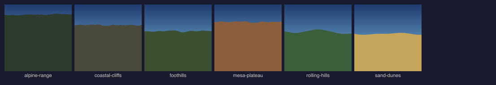](#profile-6)

| Preview | ID | Name | Description | Ridges | Tags |
|---|---|---|---|---|---|
| [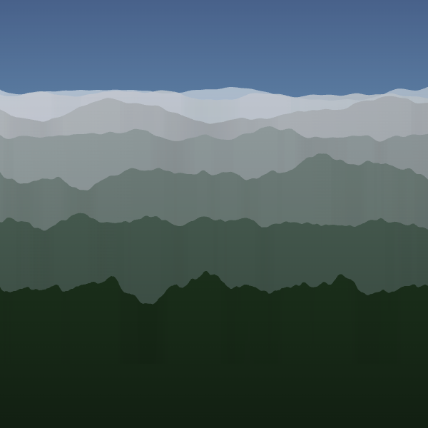](examples/profile/alpine-range.png) | `alpine-range` | Alpine Range | Sharp, jagged alpine peaks with multiple receding ridges | 5 | mountains, alpine, jagged, dramatic |
| [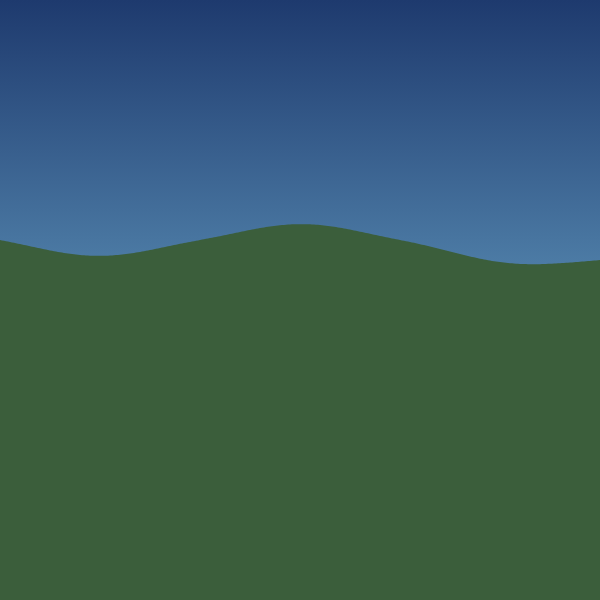](examples/profile/rolling-hills.png) | `rolling-hills` | Rolling Hills | Gentle, smooth rolling hills with soft contours | 3 | hills, gentle, pastoral, soft |
| [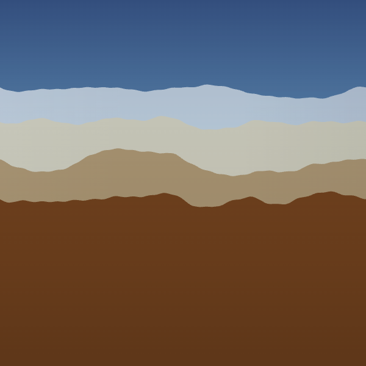](examples/profile/mesa-plateau.png) | `mesa-plateau` | Mesa Plateau | Flat-topped mesa formations with steep cliff sides | 2 | desert, mesa, flat-top, arid |
| [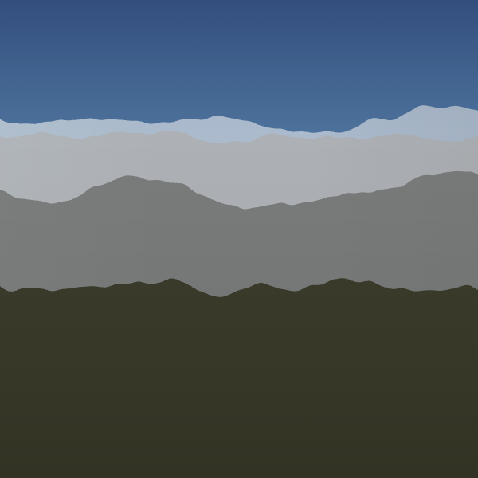](examples/profile/coastal-cliffs.png) | `coastal-cliffs` | Coastal Cliffs | Dramatic coastal cliffs with weathered profiles | 2 | coast, cliffs, dramatic, ocean |
| [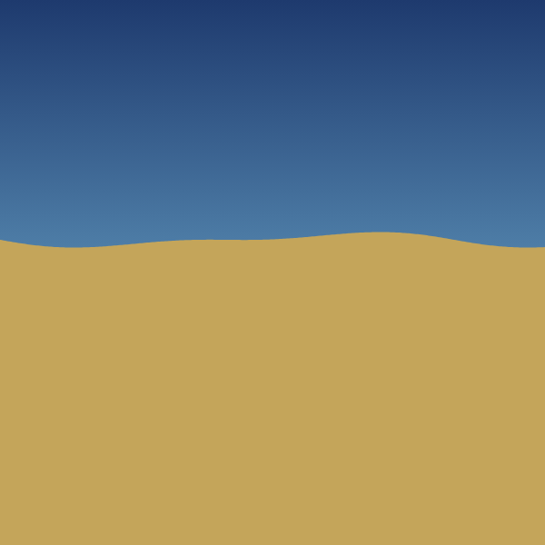](examples/profile/sand-dunes.png) | `sand-dunes` | Sand Dunes | Smooth undulating sand dunes with minimal roughness | 4 | desert, dunes, smooth, sand |
| [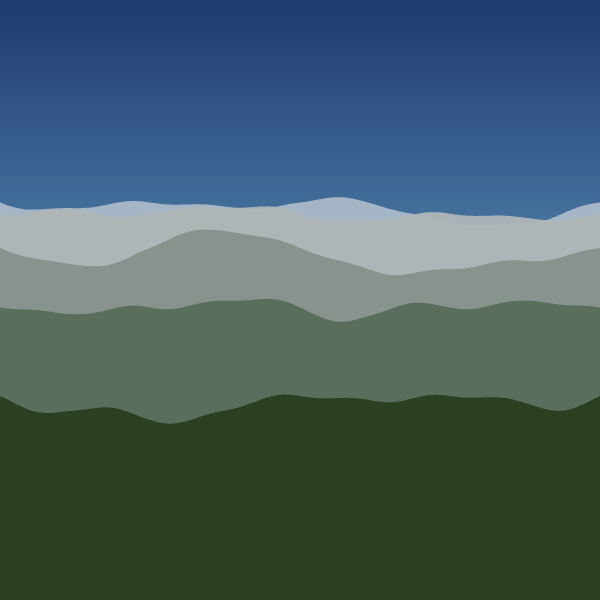](examples/profile/foothills.png) | `foothills` | Foothills | Low foothills transitioning from plains with moderate elevation | 4 | hills, foothills, transitional, moderate |

### Clouds (5)

[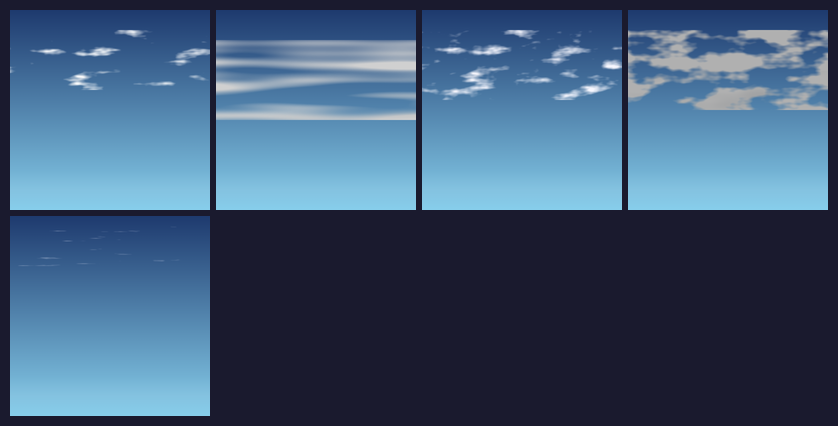](#clouds-5)

| Preview | ID | Name | Description | Type | Coverage | Tags |
|---|---|---|---|---|---|---|
| [](examples/clouds/fair-weather.png) | `fair-weather` | Fair Weather | Scattered cumulus clouds on a clear day | cumulus | 0.3 | cumulus, light, clear, scattered |
| [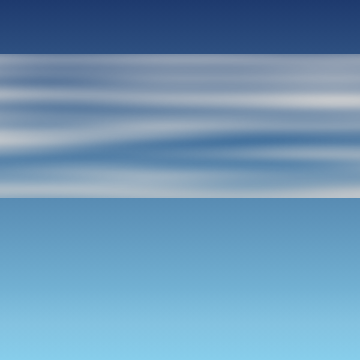](examples/clouds/overcast.png) | `overcast` | Overcast | Heavy stratus cloud cover blanketing the sky | stratus | 0.75 | stratus, heavy, grey, uniform |
| [](examples/clouds/wispy-high.png) | `wispy-high` | Wispy High | Thin cirrus wisps high in the atmosphere | cirrus | 0.2 | cirrus, thin, high, wispy |
| [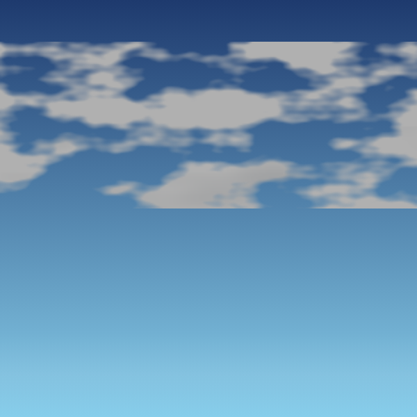](examples/clouds/storm-clouds.png) | `storm-clouds` | Storm Clouds | Dense, dark cumulonimbus clouds building before a storm | cumulus | 0.6 | cumulus, dark, storm, dramatic |
| [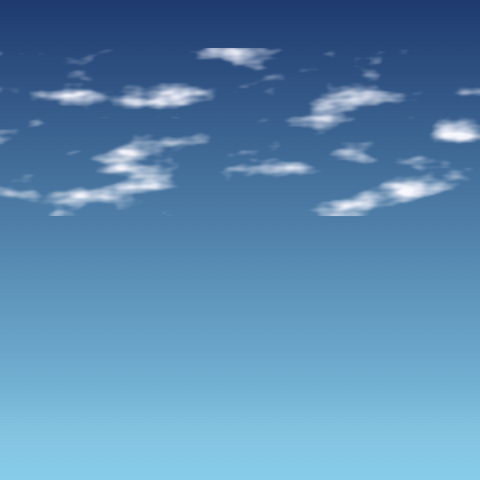](examples/clouds/scattered.png) | `scattered` | Scattered | Mixed scattered clouds at varying altitudes | cumulus | 0.4 | cumulus, scattered, mixed, varied |

### Water (5)

[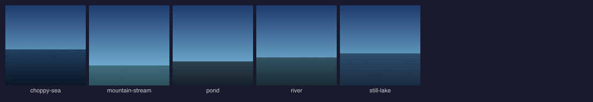](#water-5)

| Preview | ID | Name | Description | Ripple Mode | Tags |
|---|---|---|---|---|---|
| [](examples/water/still-lake.png) | `still-lake` | Still Lake | Calm, mirror-like lake surface with minimal ripples | sine | calm, lake, mirror, peaceful |
| [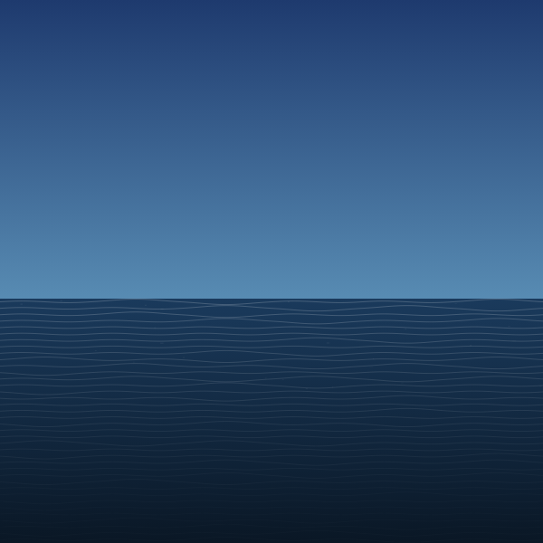](examples/water/choppy-sea.png) | `choppy-sea` | Choppy Sea | Rough ocean surface with strong waves and whitecaps | noise | ocean, rough, waves, dramatic |
| [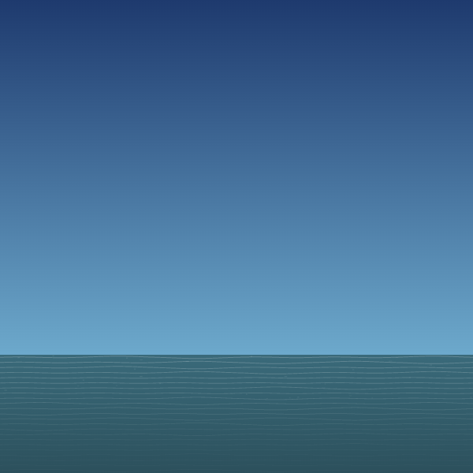](examples/water/mountain-stream.png) | `mountain-stream` | Mountain Stream | Clear mountain stream with visible ripple patterns | noise | stream, clear, mountain, fresh |
| [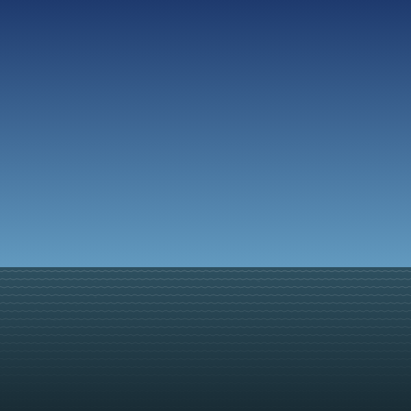](examples/water/river.png) | `river` | River | Wide river with moderate current and surface texture | sine | river, moderate, flowing, wide |
| [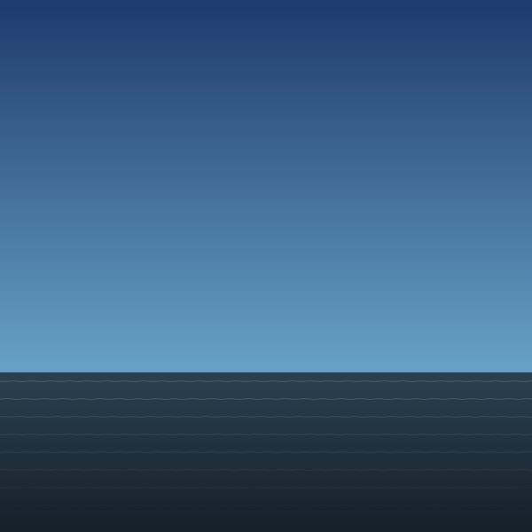](examples/water/pond.png) | `pond` | Pond | Small quiet pond with subtle surface movement | sine | pond, quiet, small, still |

### River (8)

[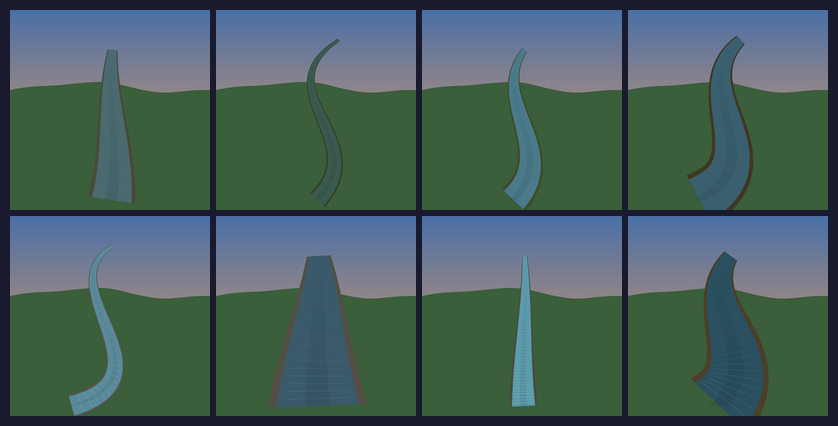](#river-8)

| Preview | ID | Name | Description | Tags |
|---|---|---|---|---|
| [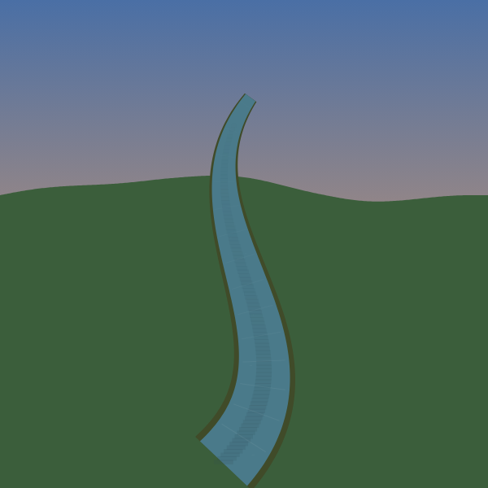](examples/river/gentle-stream.png) | `gentle-stream` | Gentle Stream | Calm, meandering stream with soft banks | calm, stream, gentle, peaceful |
| [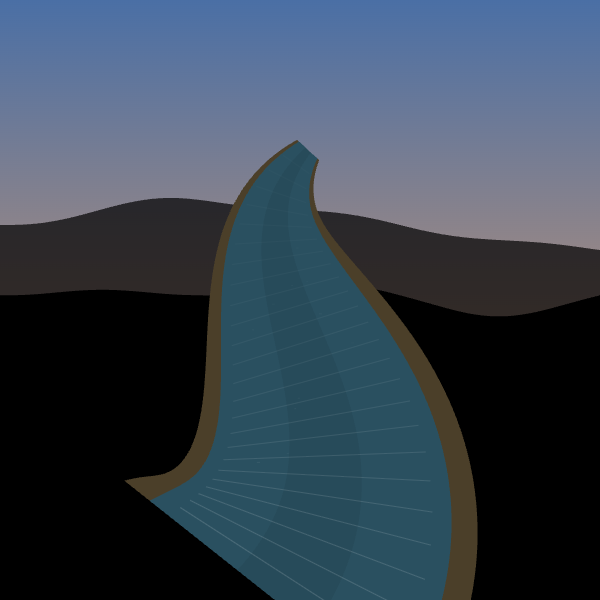](examples/river/wide-river.png) | `wide-river` | Wide River | Broad river with steady flow | wide, river, flowing, deep |
| [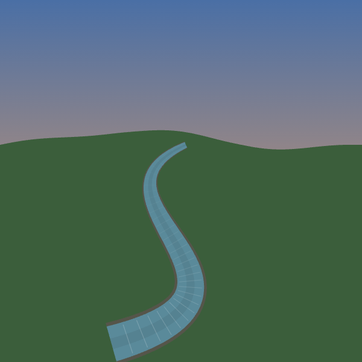](examples/river/mountain-creek.png) | `mountain-creek` | Mountain Creek | Fast-flowing rocky creek | mountain, creek, fast, rocky |
| [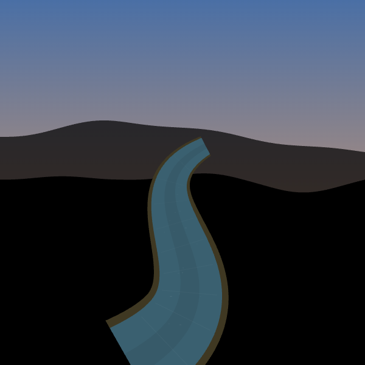](examples/river/lazy-oxbow.png) | `lazy-oxbow` | Lazy Oxbow | Slow, winding oxbow curve | slow, oxbow, winding, marshy |
| [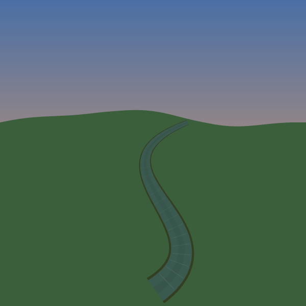](examples/river/forest-brook.png) | `forest-brook` | Forest Brook | Narrow brook through woodland | forest, brook, narrow, shaded |
| [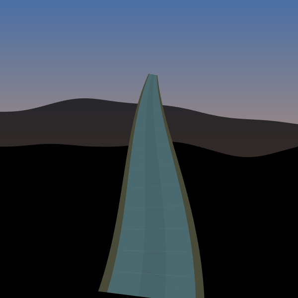](examples/river/delta-channels.png) | `delta-channels` | Delta Channels | Branching delta waterways | delta, channels, branching, coastal |
| [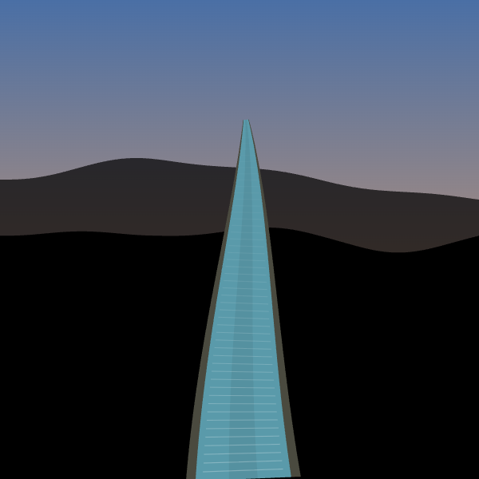](examples/river/waterfall-stream.png) | `waterfall-stream` | Waterfall Stream | Stream with cascading flow | waterfall, cascade, rushing, rocky |
| [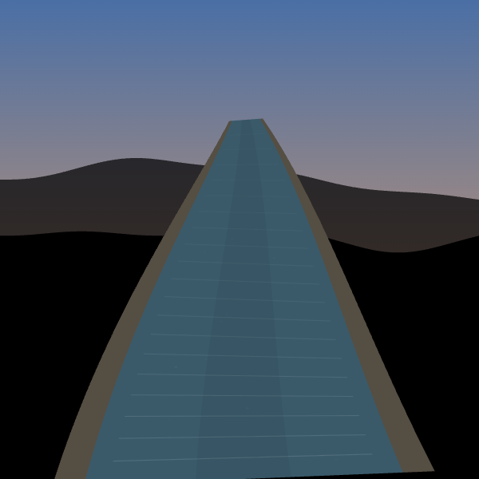](examples/river/tidal-estuary.png) | `tidal-estuary` | Tidal Estuary | Wide tidal estuary meeting the sea | tidal, estuary, wide, coastal |

### Path (8)

[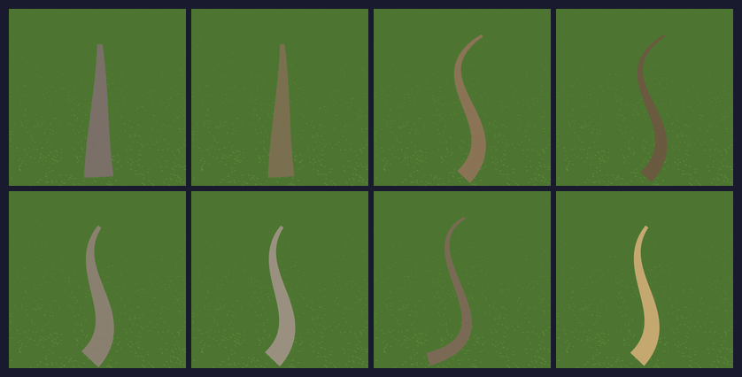](#path-8)

| Preview | ID | Name | Description | Tags |
|---|---|---|---|---|
| [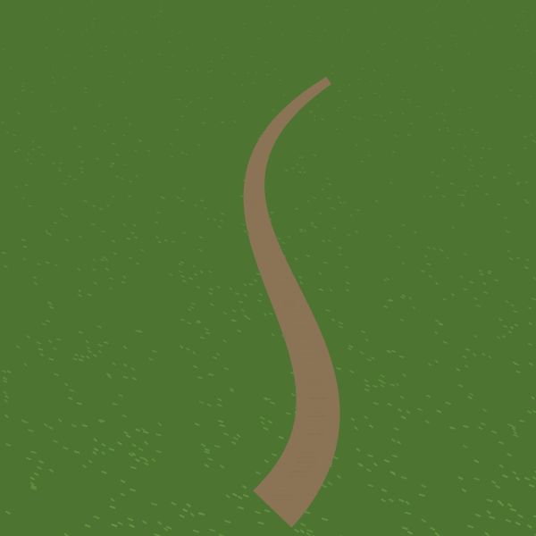](examples/path/dirt-trail.png) | `dirt-trail` | Dirt Trail | Worn dirt path through open terrain | dirt, trail, worn, natural |
| [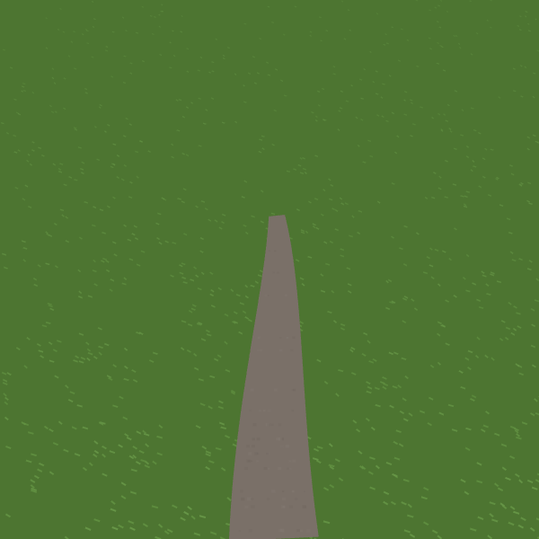](examples/path/cobblestone-road.png) | `cobblestone-road` | Cobblestone Road | Old cobblestone road with uneven stones | cobblestone, road, old, stone |
| [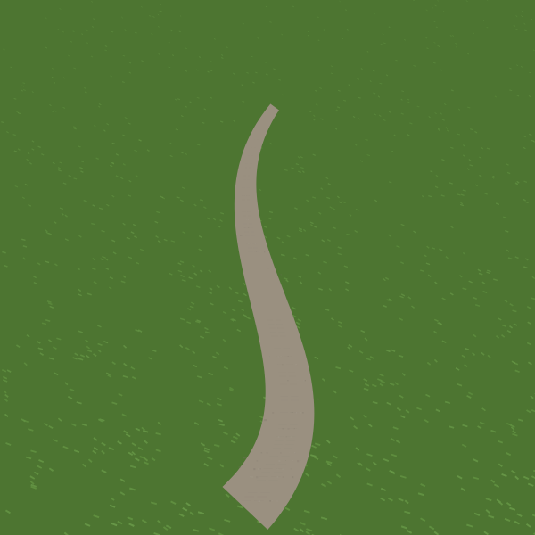](examples/path/gravel-path.png) | `gravel-path` | Gravel Path | Crunchy gravel garden path | gravel, path, garden, neat |
| [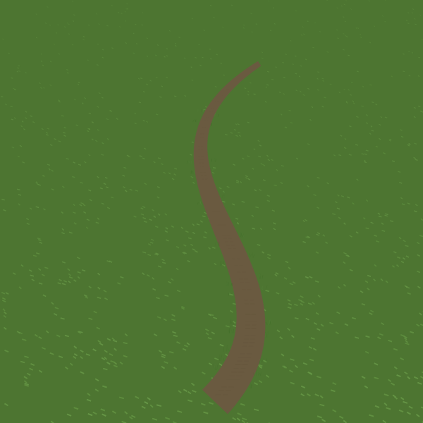](examples/path/forest-path.png) | `forest-path` | Forest Path | Shaded path through dense woodland | forest, path, shaded, mossy |
| [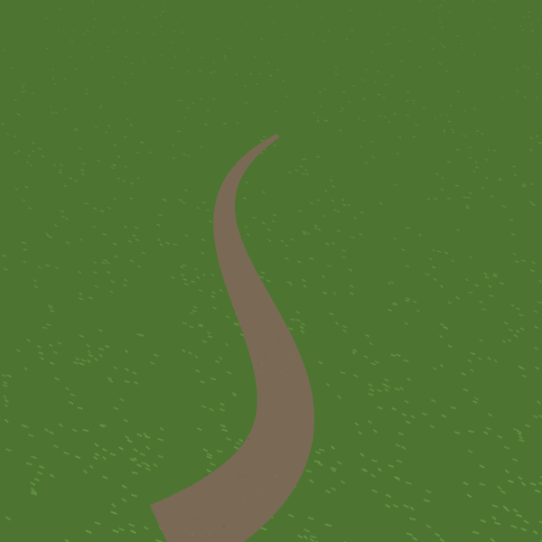](examples/path/mountain-switchback.png) | `mountain-switchback` | Mountain Switchback | Steep zigzag trail up a mountain | mountain, switchback, steep, exposed |
| [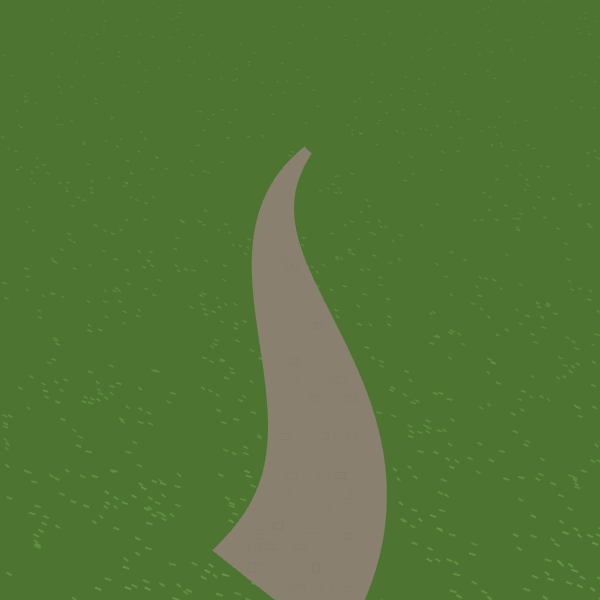](examples/path/garden-walk.png) | `garden-walk` | Garden Walk | Manicured garden walkway | garden, walk, manicured, formal |
| [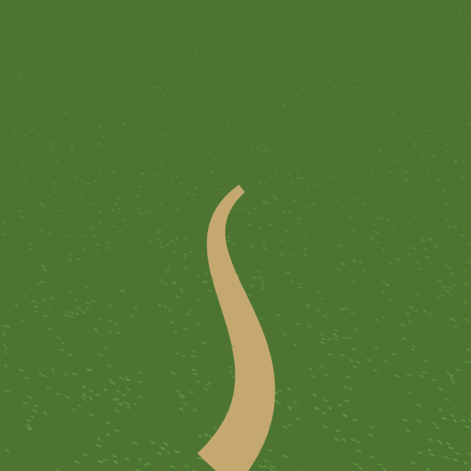](examples/path/sand-track.png) | `sand-track` | Sand Track | Sandy track through dunes or beach | sand, track, beach, desert |
| [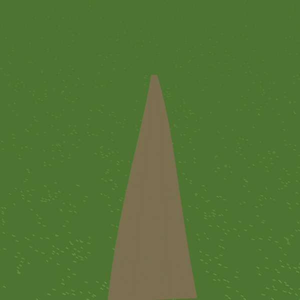](examples/path/country-lane.png) | `country-lane` | Country Lane | Quiet lane through rolling countryside | country, lane, quiet, pastoral |

### Shore (6)

[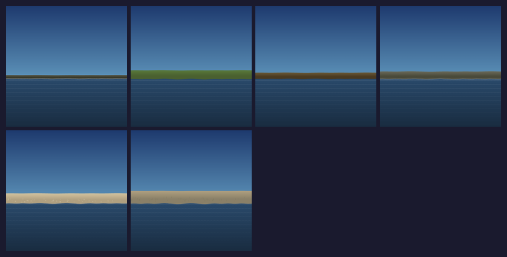](#shore-6)

| Preview | ID | Name | Description | Tags |
|---|---|---|---|---|
| [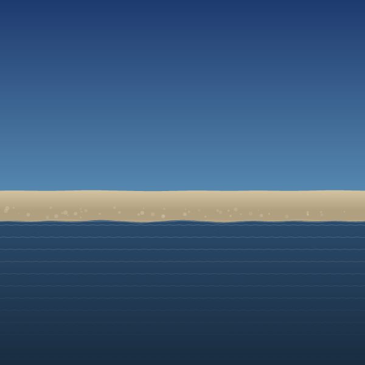](examples/shore/sandy-beach.png) | `sandy-beach` | Sandy Beach | Wide sandy beach with gentle slope | sandy, beach, wide, warm |
| [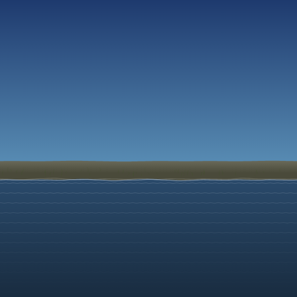](examples/shore/rocky-shore.png) | `rocky-shore` | Rocky Shore | Rugged shoreline with boulders | rocky, shore, rugged, dramatic |
| [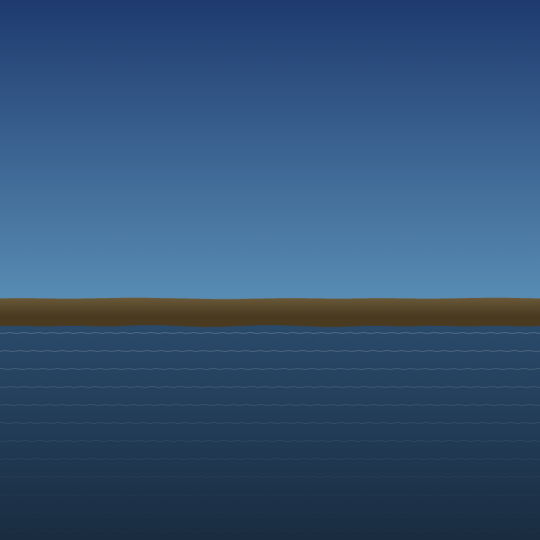](examples/shore/muddy-riverbank.png) | `muddy-riverbank` | Muddy Riverbank | Soft muddy bank along a river | muddy, riverbank, soft, marshy |
| [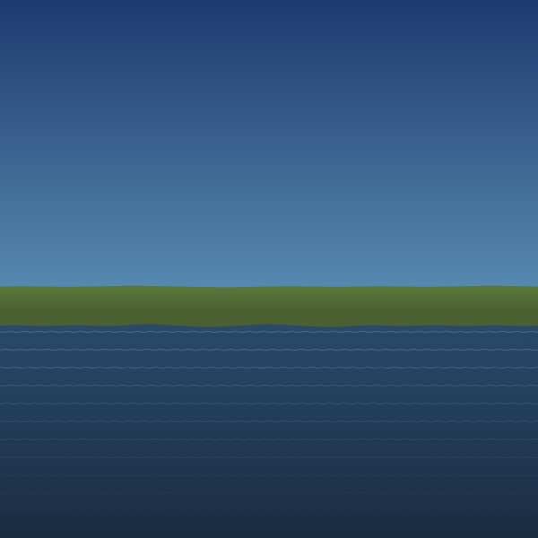](examples/shore/grassy-bank.png) | `grassy-bank` | Grassy Bank | Green grass growing down to water's edge | grassy, bank, green, gentle |
| [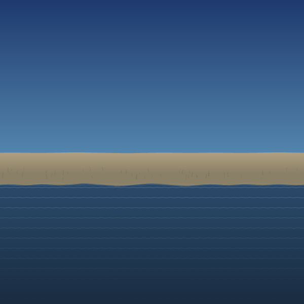](examples/shore/tidal-flat.png) | `tidal-flat` | Tidal Flat | Exposed tidal flat at low tide | tidal, flat, exposed, coastal |
| [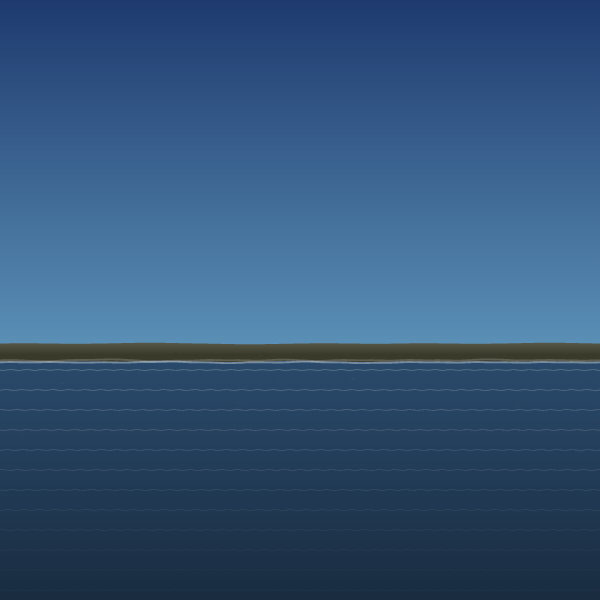](examples/shore/cliff-base.png) | `cliff-base` | Cliff Base | Base of a cliff where rock meets water | cliff, base, rock, dramatic |

### Field (8)

[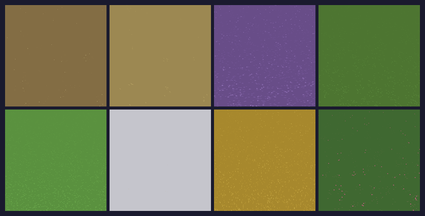](#field-8)

| Preview | ID | Name | Description | Tags |
|---|---|---|---|---|
| [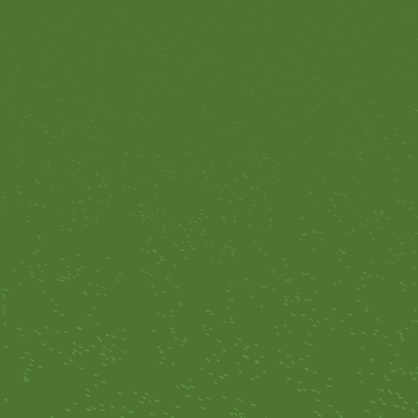](examples/field/meadow-grass.png) | `meadow-grass` | Meadow Grass | Lush green meadow with mixed grasses | meadow, grass, green, lush |
| [](examples/field/wheat-field.png) | `wheat-field` | Wheat Field | Golden wheat field ready for harvest | wheat, golden, harvest, warm |
| [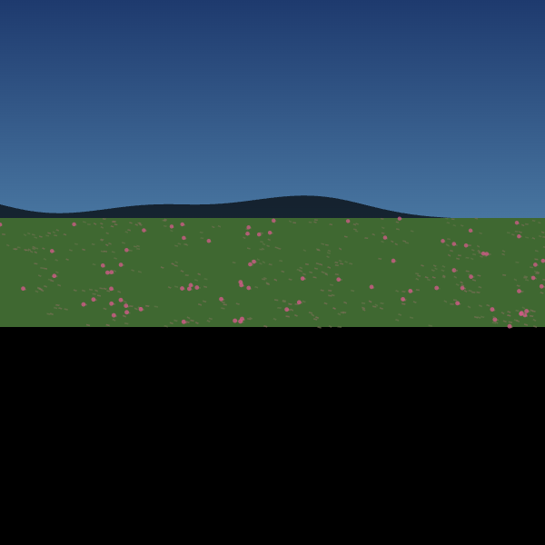](examples/field/wildflower-meadow.png) | `wildflower-meadow` | Wildflower Meadow | Colorful wildflower-dotted grassland | wildflower, meadow, colorful, spring |
| [](examples/field/lavender-rows.png) | `lavender-rows` | Lavender Rows | Orderly rows of lavender in bloom | lavender, rows, purple, fragrant |
| [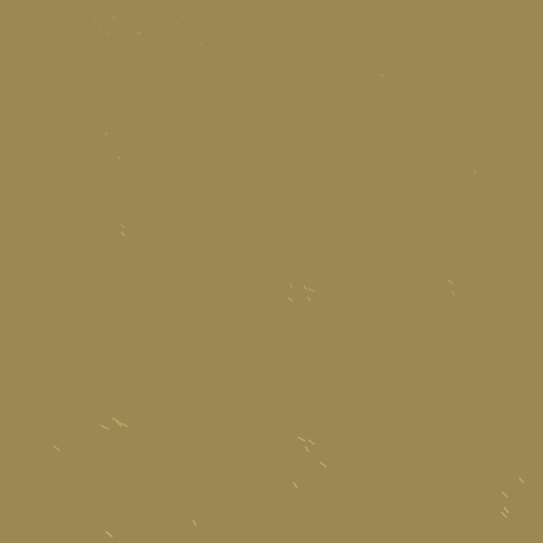](examples/field/dry-savanna.png) | `dry-savanna` | Dry Savanna | Dry golden savanna grassland | savanna, dry, golden, hot |
| [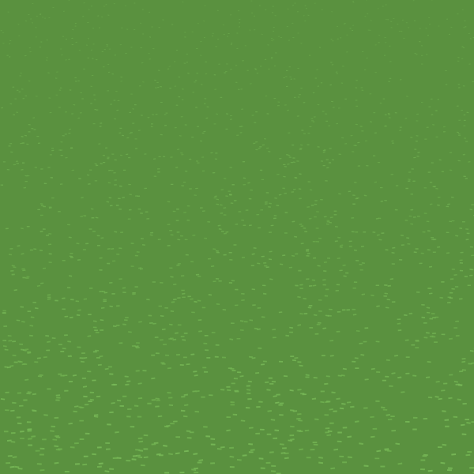](examples/field/rice-paddy.png) | `rice-paddy` | Rice Paddy | Flooded rice paddy with green shoots | rice, paddy, green, water |
| [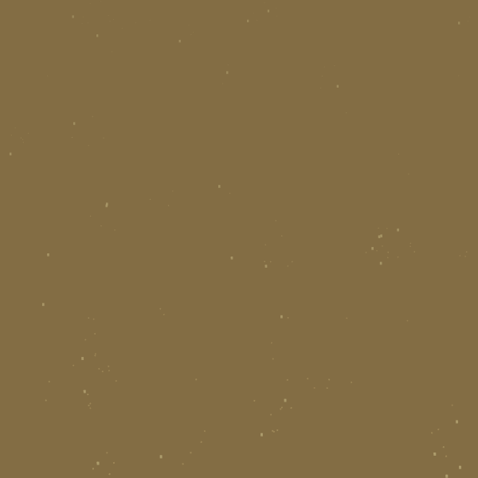](examples/field/autumn-stubble.png) | `autumn-stubble` | Autumn Stubble | Harvested field with stubble remaining | autumn, stubble, brown, harvested |
| [](examples/field/snow-covered.png) | `snow-covered` | Snow Covered | Field covered in a blanket of snow | snow, covered, white, winter |

### Rock (6)

[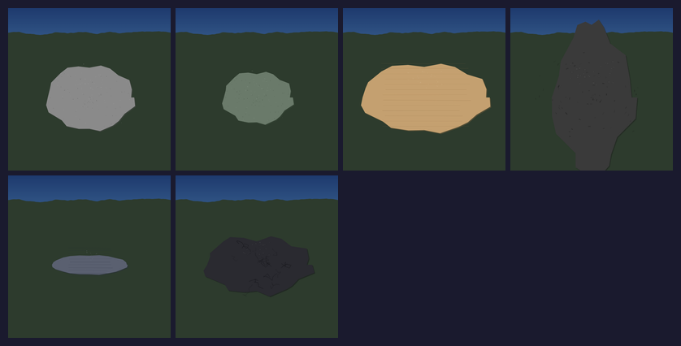](#rock-6)

| Preview | ID | Name | Description | Tags |
|---|---|---|---|---|
| [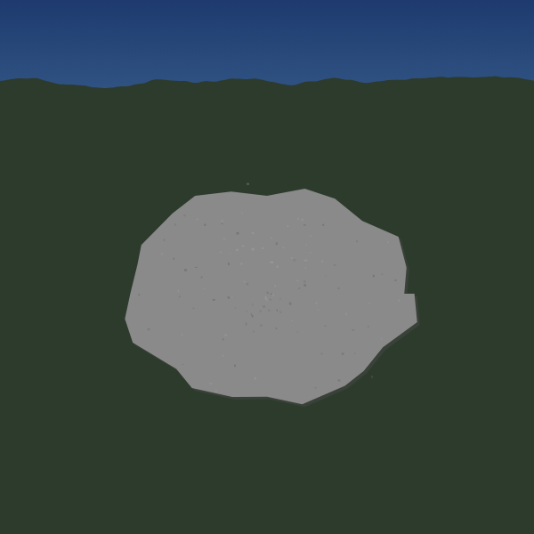](examples/rock/granite-boulder.png) | `granite-boulder` | Granite Boulder | Large granite boulder with rough texture | granite, boulder, grey, rough |
| [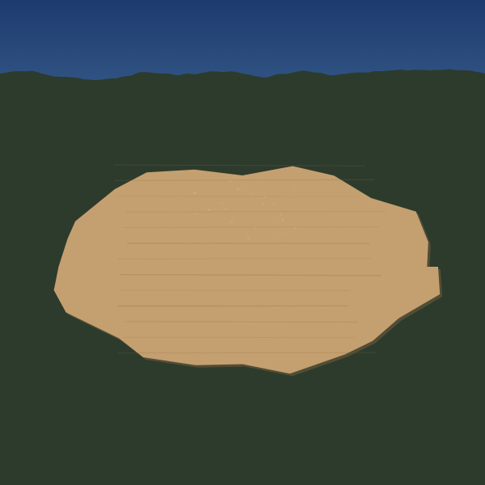](examples/rock/sandstone-outcrop.png) | `sandstone-outcrop` | Sandstone Outcrop | Layered sandstone outcrop with warm tones | sandstone, outcrop, warm, layered |
| [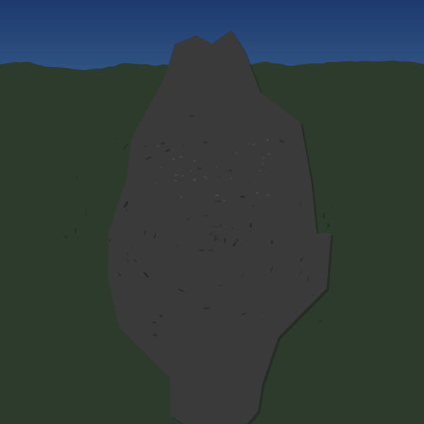](examples/rock/shan-shui-rock.png) | `shan-shui-rock` | Shan Shui Rock | Stylized Chinese landscape rock | shan-shui, rock, stylized, eastern |
| [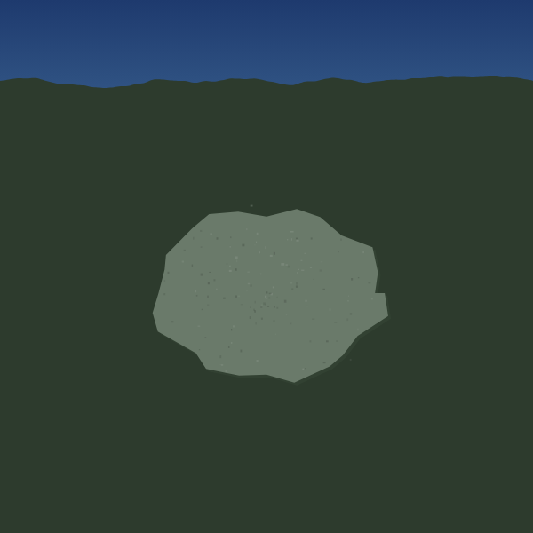](examples/rock/mossy-rock.png) | `mossy-rock` | Mossy Rock | Weathered rock covered in green moss | mossy, rock, green, old |
| [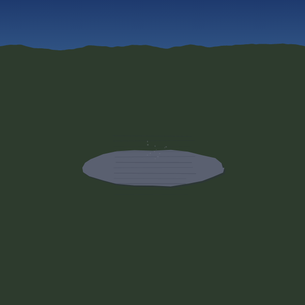](examples/rock/slate-shelf.png) | `slate-shelf` | Slate Shelf | Flat shelf of layered slate | slate, shelf, flat, dark |
| [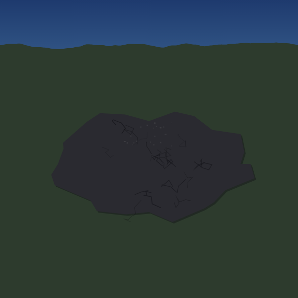](examples/rock/volcanic-basalt.png) | `volcanic-basalt` | Volcanic Basalt | Dark volcanic basalt columns | volcanic, basalt, dark, columnar |

### Treeline (6)

[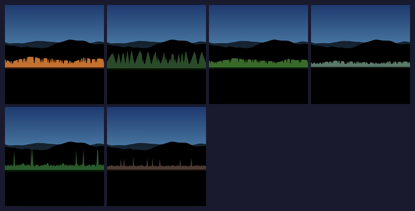](#treeline-6)

| Preview | ID | Name | Description | Tags |
|---|---|---|---|---|
| [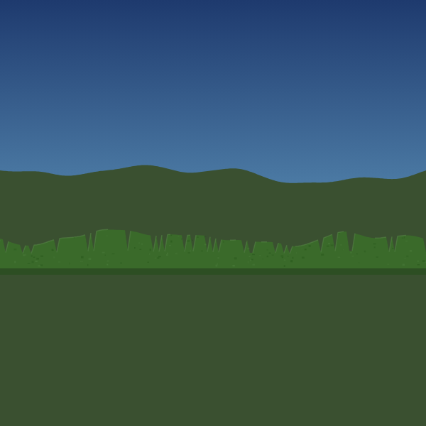](examples/treeline/deciduous-canopy.png) | `deciduous-canopy` | Deciduous Canopy | Lush deciduous tree canopy in summer | deciduous, canopy, green, summer |
| [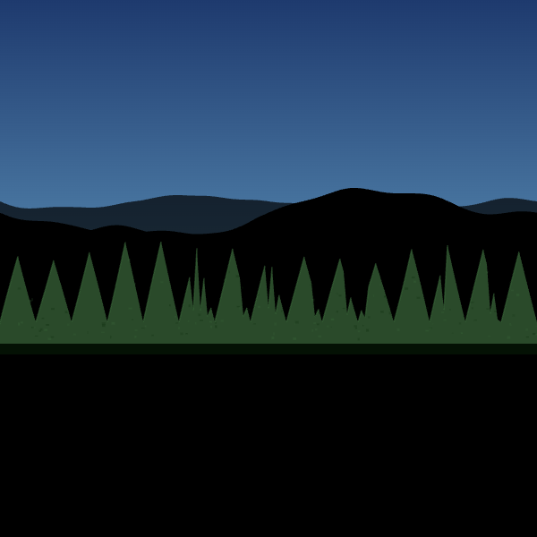](examples/treeline/conifer-ridge.png) | `conifer-ridge` | Conifer Ridge | Dense conifer ridge silhouette | conifer, ridge, dark, evergreen |
| [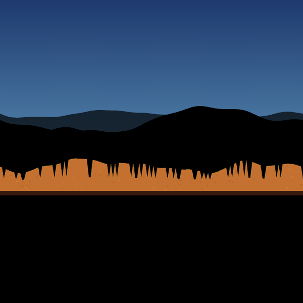](examples/treeline/autumn-treeline.png) | `autumn-treeline` | Autumn Treeline | Treeline in full autumn color | autumn, treeline, colorful, warm |
| [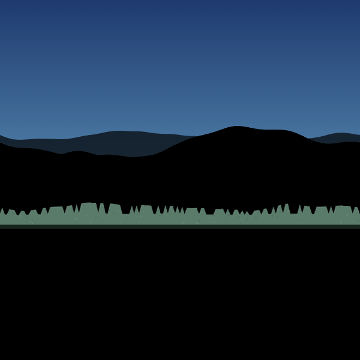](examples/treeline/misty-forest.png) | `misty-forest` | Misty Forest | Forest edge shrouded in mist | misty, forest, atmospheric, soft |
| [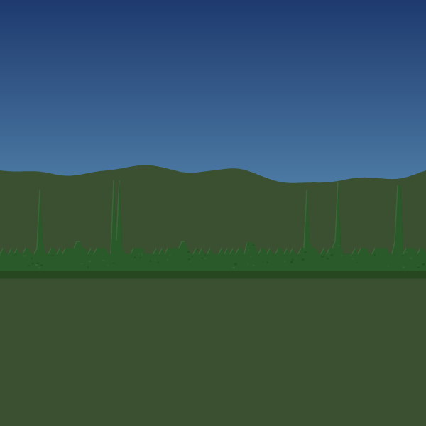](examples/treeline/palm-fringe.png) | `palm-fringe` | Palm Fringe | Tropical palm tree silhouettes | palm, tropical, silhouette, coastal |
| [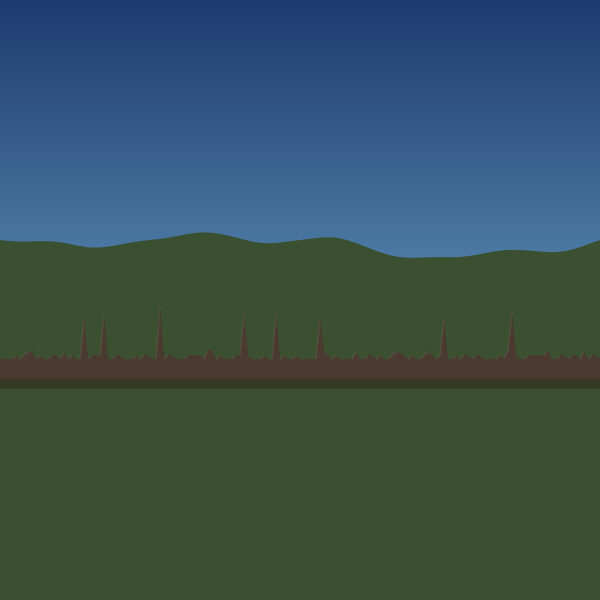](examples/treeline/winter-bare.png) | `winter-bare` | Winter Bare | Bare winter trees with no leaves | winter, bare, stark, cold |

### Celestial (6)

[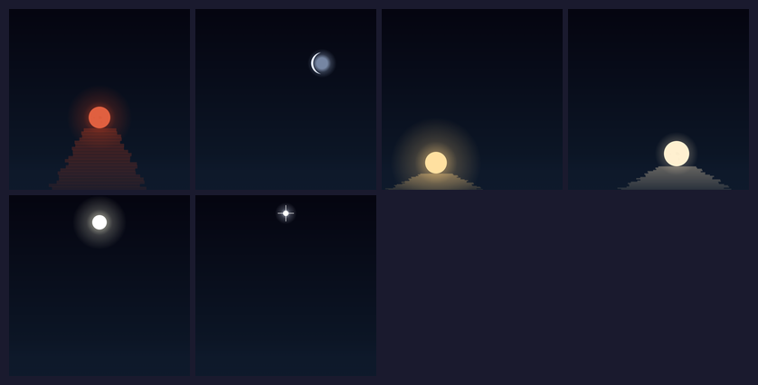](#celestial-6)

| Preview | ID | Name | Description | Tags |
|---|---|---|---|---|
| [](examples/celestial/noon-sun.png) | `noon-sun` | Noon Sun | Bright overhead sun | sun, noon, bright, warm |
| [](examples/celestial/golden-hour-sun.png) | `golden-hour-sun` | Golden Hour Sun | Low sun with golden glow | sun, golden, warm, atmospheric |
| [](examples/celestial/harvest-moon.png) | `harvest-moon` | Harvest Moon | Large amber harvest moon | moon, harvest, amber, warm |
| [](examples/celestial/crescent-moon.png) | `crescent-moon` | Crescent Moon | Thin crescent moon | moon, crescent, cool, night |
| [](examples/celestial/blood-moon.png) | `blood-moon` | Blood Moon | Deep red lunar eclipse moon | moon, blood, red, dramatic |
| [](examples/celestial/polar-star.png) | `polar-star` | Polar Star | Bright northern star with glow | star, polar, bright, night |

### Fog (5)

[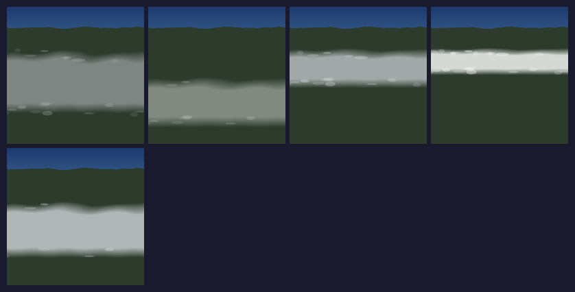](#fog-5)

| Preview | ID | Name | Description | Tags |
|---|---|---|---|---|
| [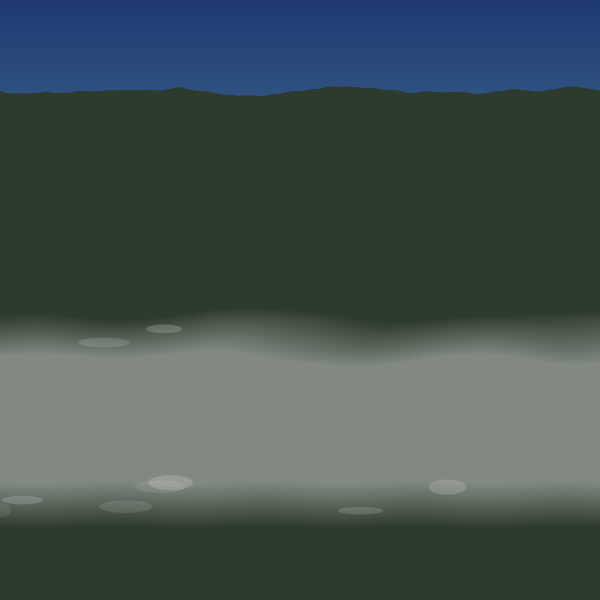](examples/fog/morning-mist.png) | `morning-mist` | Morning Mist | Light morning mist in low areas | morning, mist, light, soft |
| [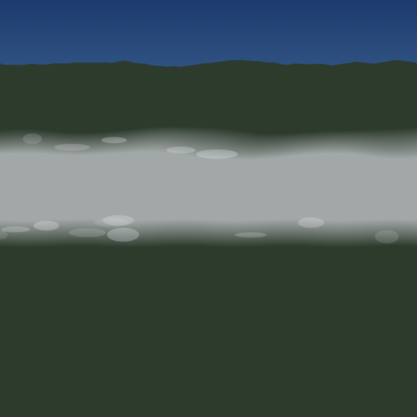](examples/fog/mountain-veil.png) | `mountain-veil` | Mountain Veil | Fog wrapping around mountain bases | mountain, veil, thick, atmospheric |
| [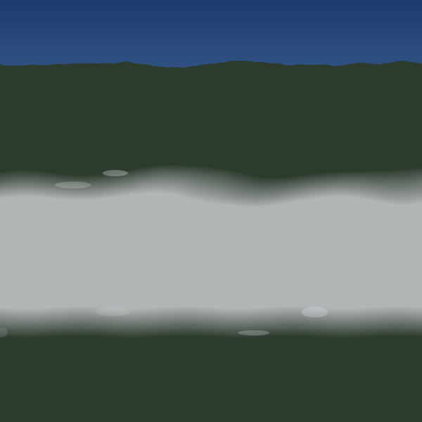](examples/fog/valley-fog.png) | `valley-fog` | Valley Fog | Dense fog filling a valley | valley, fog, dense, cold |
| [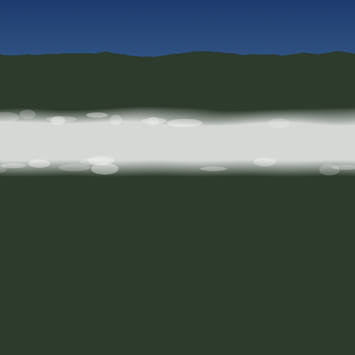](examples/fog/shan-shui-cloud-band.png) | `shan-shui-cloud-band` | Shan Shui Cloud Band | Stylized cloud band for ink-wash landscapes | shan-shui, cloud, band, eastern |
| [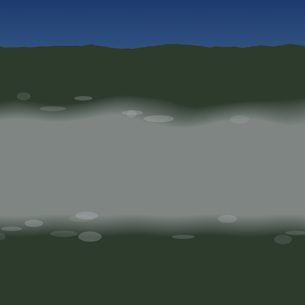](examples/fog/coastal-haar.png) | `coastal-haar` | Coastal Haar | Sea fog rolling in from the coast | coastal, haar, rolling, cool |

### Starfield (5)

[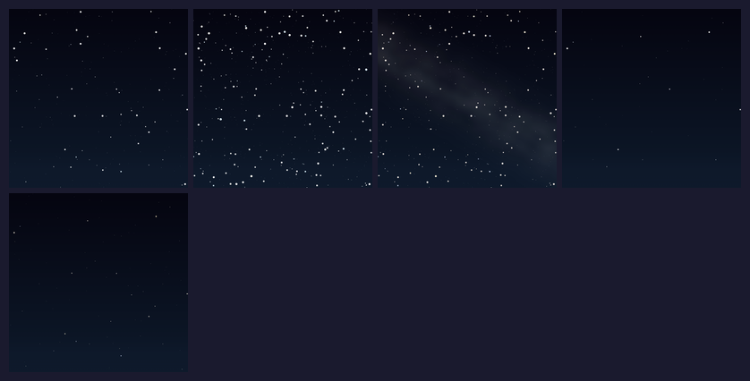](#starfield-5)

| Preview | ID | Name | Description | Tags |
|---|---|---|---|---|
| [](examples/starfield/clear-night.png) | `clear-night` | Clear Night | Clear night sky with scattered stars | clear, night, scattered, standard |
| [](examples/starfield/dense-starfield.png) | `dense-starfield` | Dense Starfield | Densely packed star field | dense, starfield, packed, bright |
| [](examples/starfield/milky-way.png) | `milky-way` | Milky Way | Milky Way band across the sky | milky-way, band, galactic, dramatic |
| [](examples/starfield/sparse-stars.png) | `sparse-stars` | Sparse Stars | Few scattered stars in early twilight | sparse, stars, twilight, subtle |
| [](examples/starfield/twilight-stars.png) | `twilight-stars` | Twilight Stars | Stars emerging at dusk | twilight, stars, emerging, dusk |

### Cliff Face (5)

[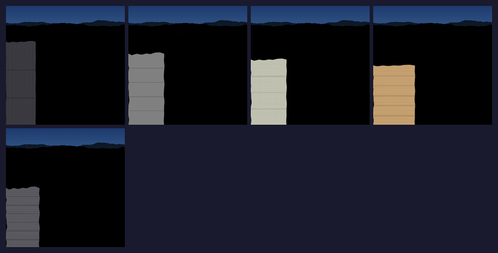](#cliff-face-5)

| Preview | ID | Name | Description | Tags |
|---|---|---|---|---|
| [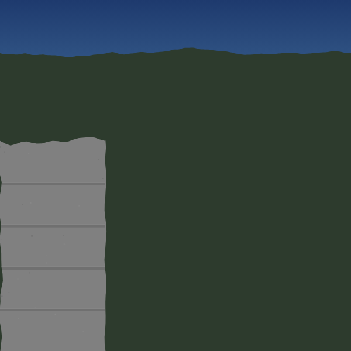](examples/cliff-face/granite-cliff.png) | `granite-cliff` | Granite Cliff | Sheer granite cliff face | granite, cliff, sheer, grey |
| [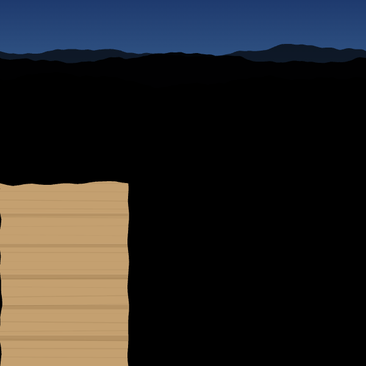](examples/cliff-face/sandstone-wall.png) | `sandstone-wall` | Sandstone Wall | Warm sandstone cliff wall | sandstone, wall, warm, layered |
| [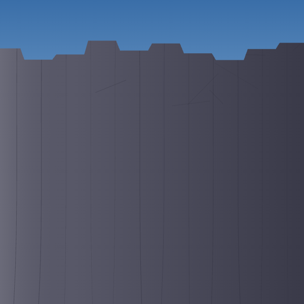](examples/cliff-face/basalt-columns.png) | `basalt-columns` | Basalt Columns | Columnar basalt cliff formation | basalt, columns, dark, geometric |
| [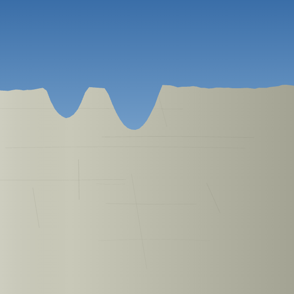](examples/cliff-face/limestone-face.png) | `limestone-face` | Limestone Face | Pale limestone cliff with erosion | limestone, face, pale, eroded |
| [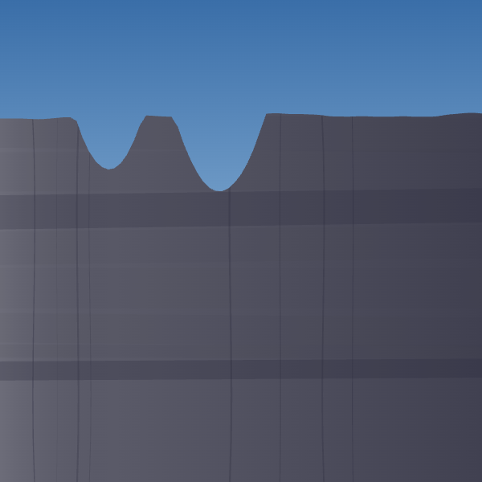](examples/cliff-face/shale-cliff.png) | `shale-cliff` | Shale Cliff | Dark layered shale cliff | shale, cliff, dark, layered |

### Snowfield (4)

[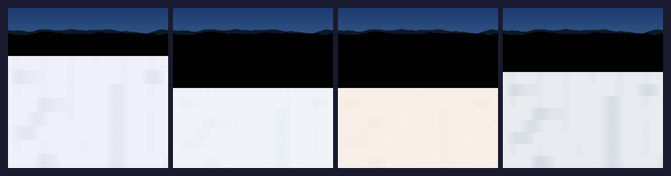](#snowfield-4)

| Preview | ID | Name | Description | Tags |
|---|---|---|---|---|
| [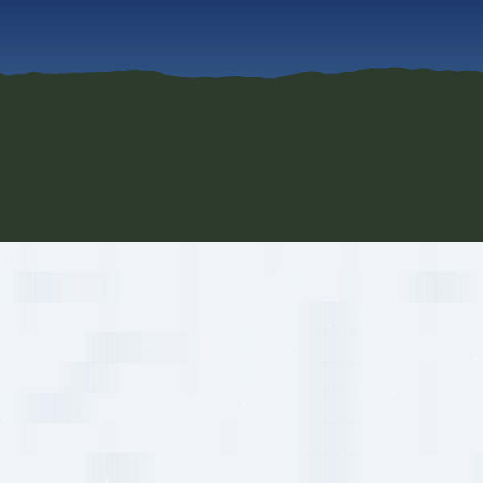](examples/snowfield/fresh-powder.png) | `fresh-powder` | Fresh Powder | Freshly fallen undisturbed snow | fresh, powder, white, pristine |
| [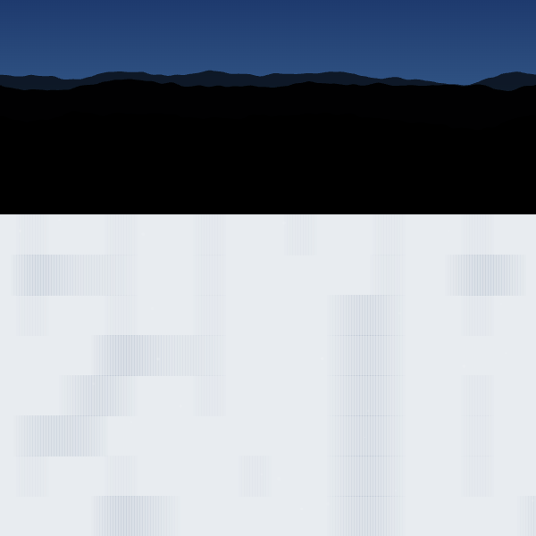](examples/snowfield/wind-swept.png) | `wind-swept` | Wind Swept | Wind-sculpted snow with ridges | wind, swept, ridges, textured |
| [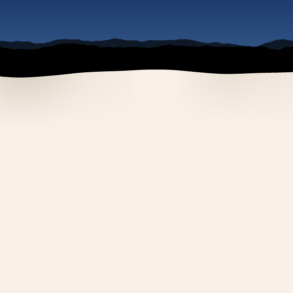](examples/snowfield/sun-crust.png) | `sun-crust` | Sun Crust | Sun-crusted snow with icy surface | sun, crust, icy, sparkling |
| [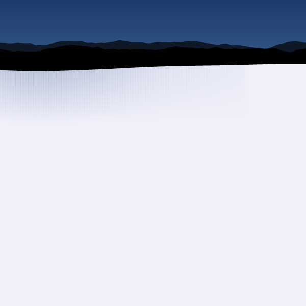](examples/snowfield/deep-snow.png) | `deep-snow` | Deep Snow | Deep snow with soft contours | deep, snow, soft, heavy |

### Building (6)

[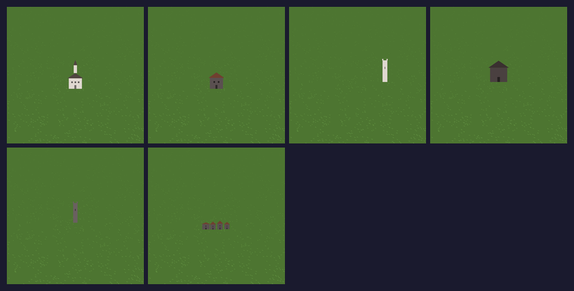](#building-6)

| Preview | ID | Name | Description | Tags |
|---|---|---|---|---|
| [](examples/building/farmhouse.png) | `farmhouse` | Farmhouse | Rustic farmhouse silhouette | farmhouse, rustic, rural, warm |
| [](examples/building/church-steeple.png) | `church-steeple` | Church Steeple | Church with pointed steeple | church, steeple, tall, village |
| [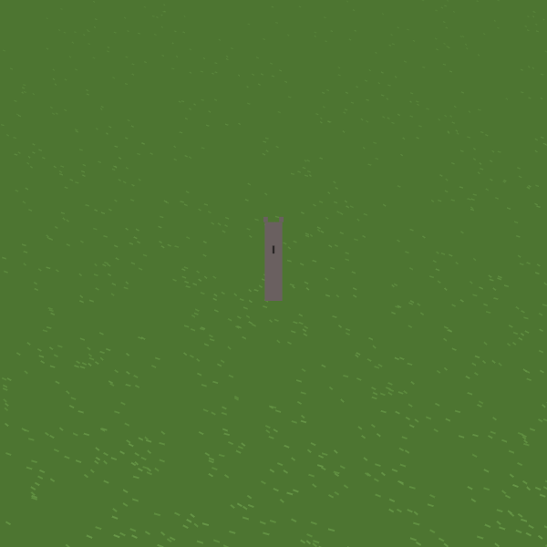](examples/building/tower-ruin.png) | `tower-ruin` | Tower Ruin | Ruined tower silhouette | tower, ruin, old, dramatic |
| [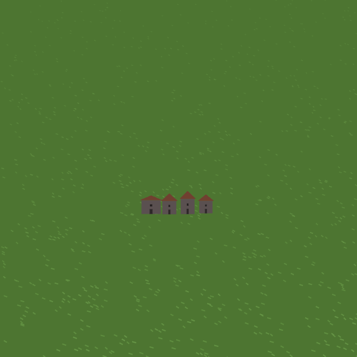](examples/building/village-cluster.png) | `village-cluster` | Village Cluster | Cluster of small buildings | village, cluster, small, grouped |
| [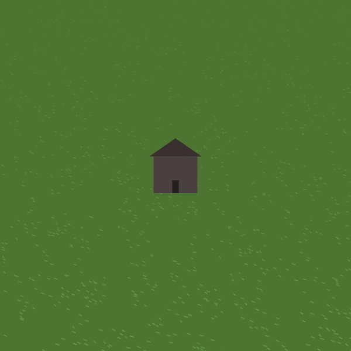](examples/building/temple.png) | `temple` | Temple | Temple or shrine structure | temple, shrine, eastern, ornate |
| [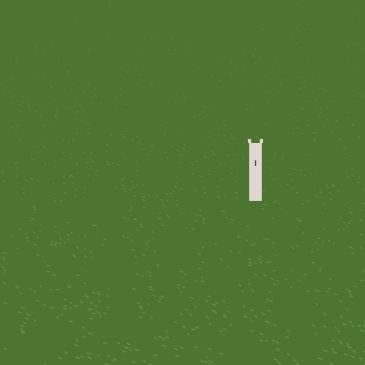](examples/building/lighthouse.png) | `lighthouse` | Lighthouse | Tall lighthouse silhouette | lighthouse, tall, coastal, beacon |

### Bridge (4)

[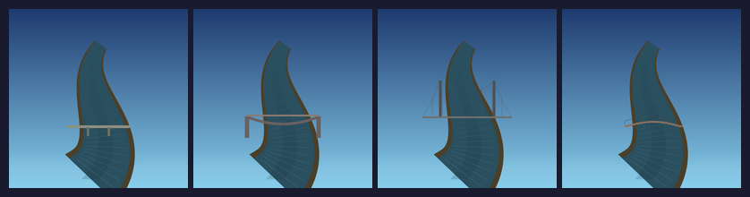](#bridge-4)

| Preview | ID | Name | Description | Tags |
|---|---|---|---|---|
| [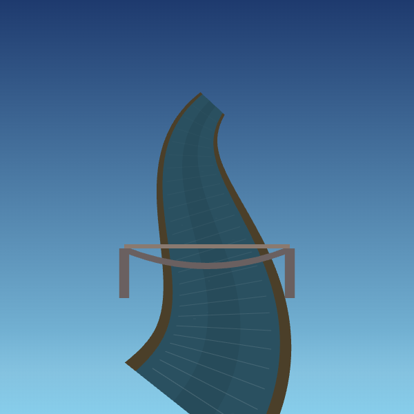](examples/bridge/stone-arch.png) | `stone-arch` | Stone Arch | Classic stone arch bridge | stone, arch, classic, old |
| [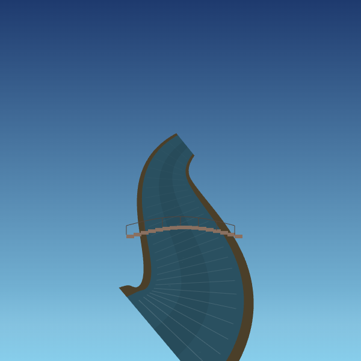](examples/bridge/wooden-footbridge.png) | `wooden-footbridge` | Wooden Footbridge | Simple wooden foot bridge | wooden, footbridge, simple, rustic |
| [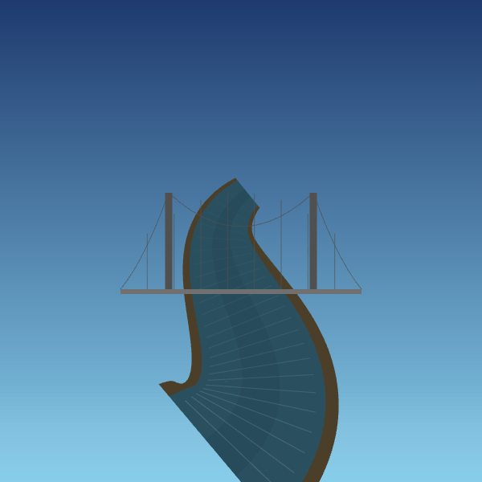](examples/bridge/suspension-bridge.png) | `suspension-bridge` | Suspension Bridge | Suspension bridge with cables | suspension, bridge, cables, modern |
| [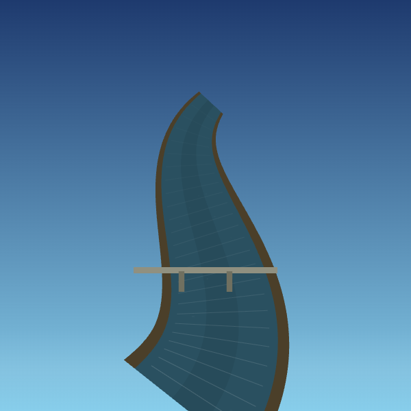](examples/bridge/flat-crossing.png) | `flat-crossing` | Flat Crossing | Low flat bridge or ford | flat, crossing, low, simple |

### Reflection (4)

[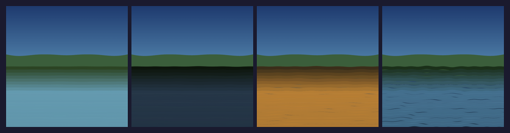](#reflection-4)

| Preview | ID | Name | Description | Tags |
|---|---|---|---|---|
| [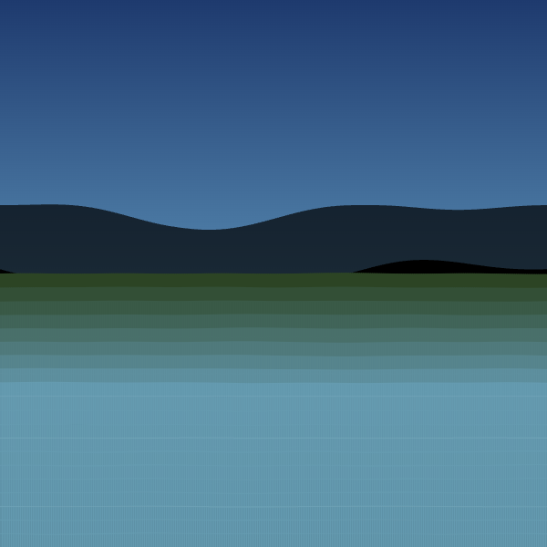](examples/reflection/calm-lake.png) | `calm-lake` | Calm Lake | Mirror-still lake reflection | calm, lake, mirror, peaceful |
| [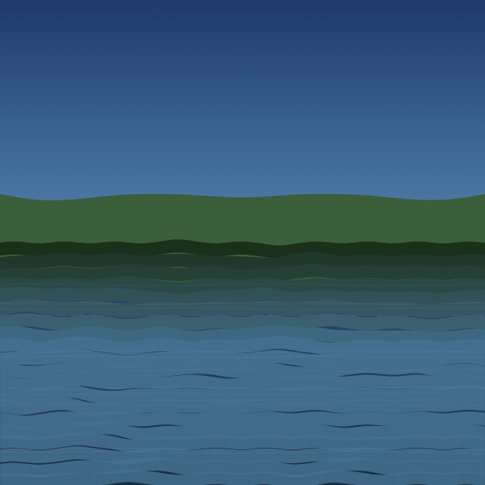](examples/reflection/rippled-reflection.png) | `rippled-reflection` | Rippled Reflection | Gently rippled water reflection | rippled, reflection, gentle, moving |
| [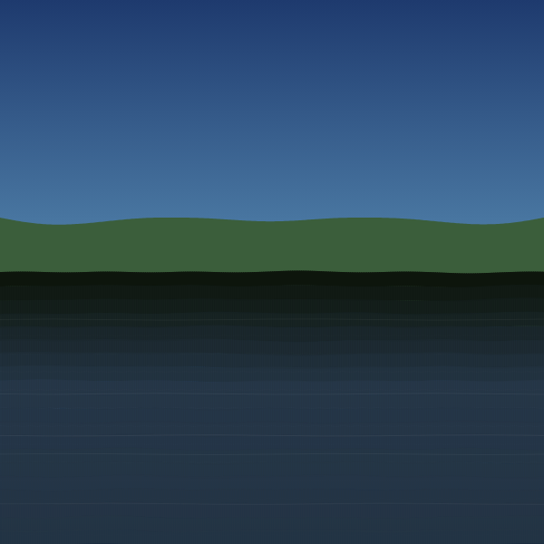](examples/reflection/dark-water.png) | `dark-water` | Dark Water | Dark, deep water reflection | dark, water, deep, moody |
| [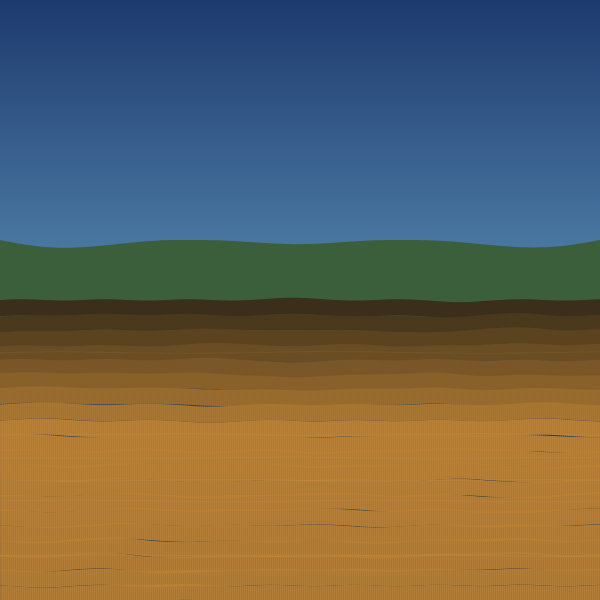](examples/reflection/golden-reflection.png) | `golden-reflection` | Golden Reflection | Warm golden light reflected in water | golden, reflection, warm, sunset |

### Vignette Foliage (5)

[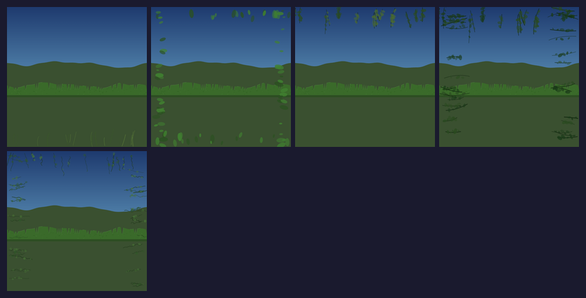](#vignette-foliage-5)

| Preview | ID | Name | Description | Tags |
|---|---|---|---|---|
| [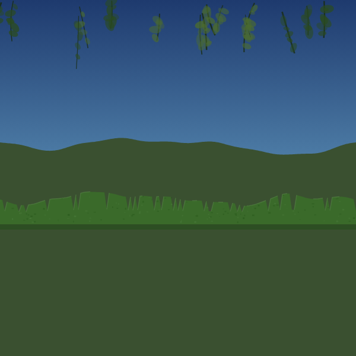](examples/vignette-foliage/overhanging-branches.png) | `overhanging-branches` | Overhanging Branches | Tree branches framing from above | branches, overhanging, framing, canopy |
| [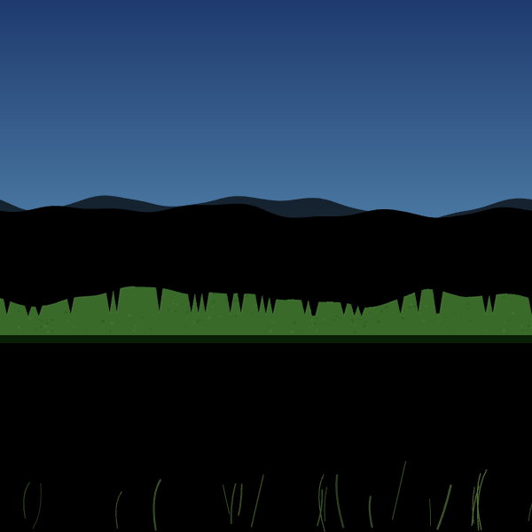](examples/vignette-foliage/grass-border.png) | `grass-border` | Grass Border | Tall grass along the bottom edge | grass, border, bottom, foreground |
| [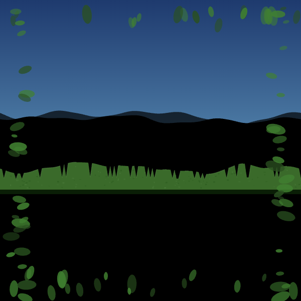](examples/vignette-foliage/leaf-frame.png) | `leaf-frame` | Leaf Frame | Decorative leaf border around edges | leaf, frame, border, decorative |
| [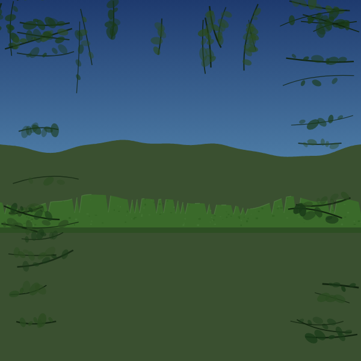](examples/vignette-foliage/pine-canopy.png) | `pine-canopy` | Pine Canopy | Pine branches framing from above | pine, canopy, dark, evergreen |
| [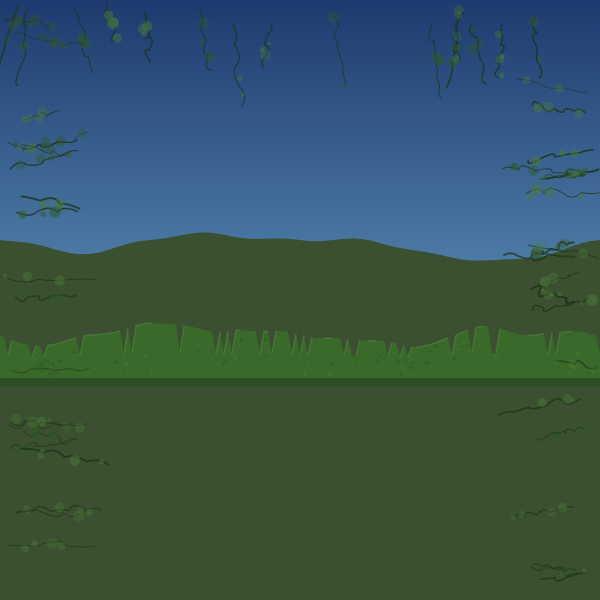](examples/vignette-foliage/vine-border.png) | `vine-border` | Vine Border | Climbing vines along the edges | vine, border, climbing, organic |

### Forest Floor (5)

[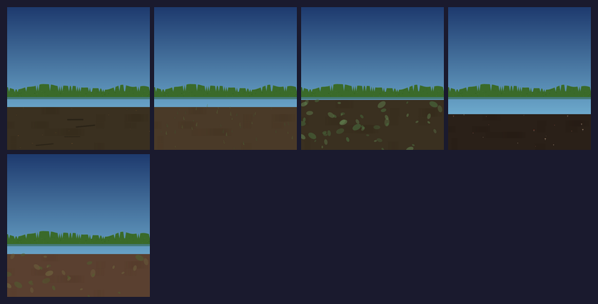](#forest-floor-5)

| Preview | ID | Name | Description | Tags |
|---|---|---|---|---|
| [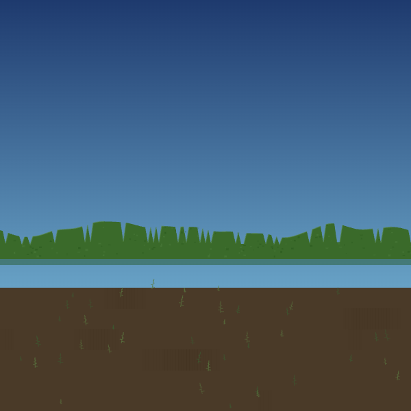](examples/forest-floor/fern-carpet.png) | `fern-carpet` | Fern Carpet | Dense fern undergrowth | fern, carpet, green, dense |
| [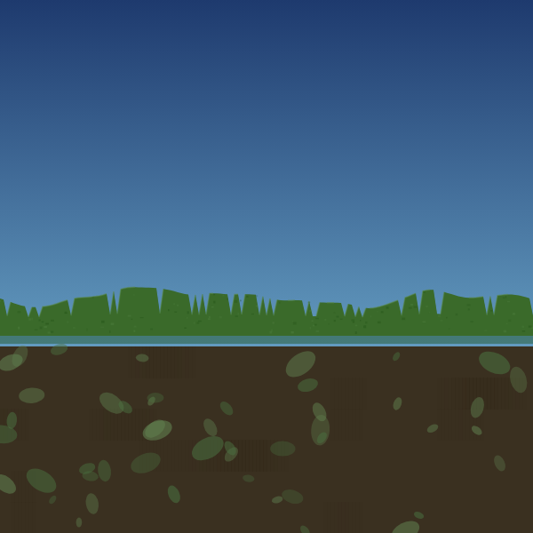](examples/forest-floor/mossy-ground.png) | `mossy-ground` | Mossy Ground | Moss-covered forest floor | mossy, ground, green, soft |
| [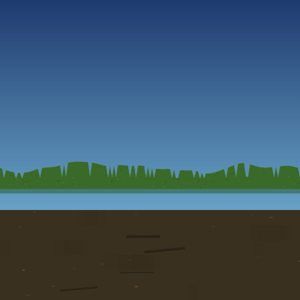](examples/forest-floor/fallen-leaves.png) | `fallen-leaves` | Fallen Leaves | Carpet of fallen autumn leaves | fallen, leaves, autumn, colorful |
| [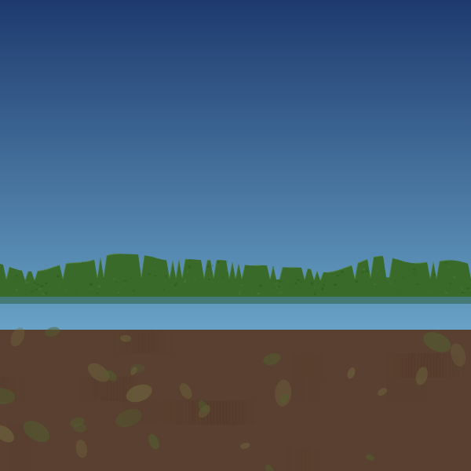](examples/forest-floor/pine-needles.png) | `pine-needles` | Pine Needles | Pine needle floor covering | pine, needles, brown, soft |
| [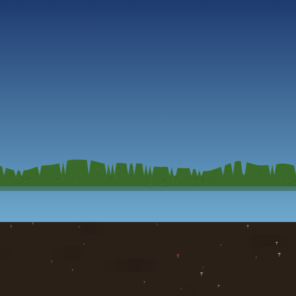](examples/forest-floor/mushroom-patch.png) | `mushroom-patch` | Mushroom Patch | Forest floor with scattered mushrooms | mushroom, patch, forest, whimsical |

### Haze (4)

[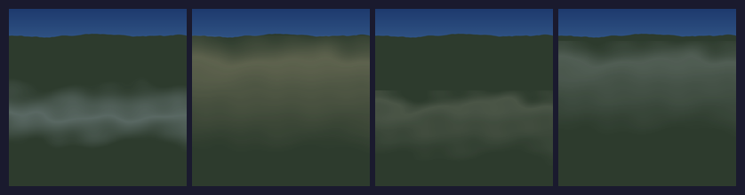](#haze-4)

| Preview | ID | Name | Description | Tags |
|---|---|---|---|---|
| [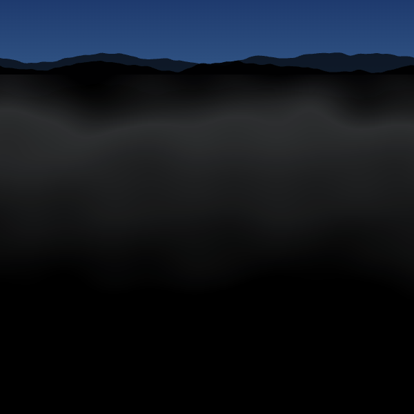](examples/haze/light-haze.png) | `light-haze` | Light Haze | Subtle atmospheric haze | light, haze, subtle, atmospheric |
| [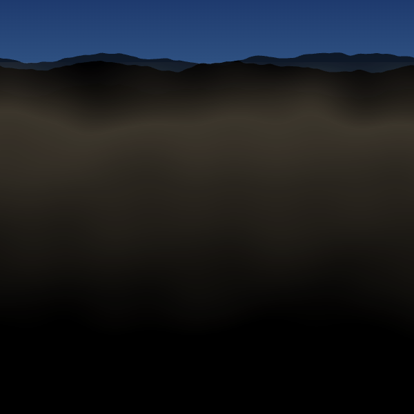](examples/haze/golden-haze.png) | `golden-haze` | Golden Haze | Warm golden atmospheric haze | golden, haze, warm, sunset |
| [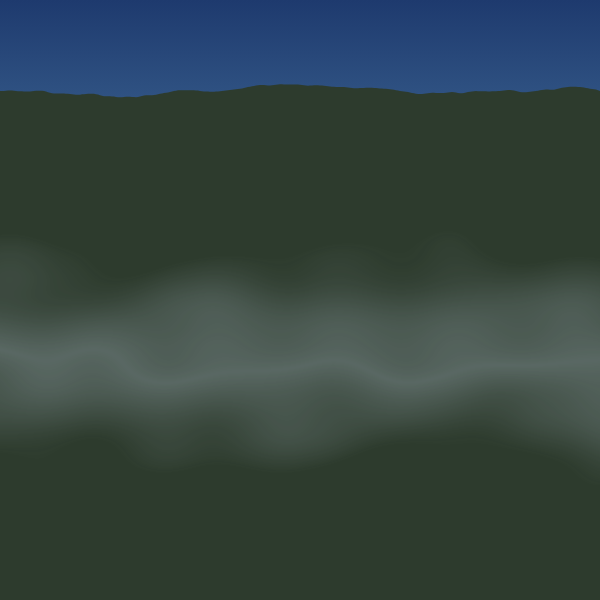](examples/haze/cool-mist.png) | `cool-mist` | Cool Mist | Cool blue-grey mist | cool, mist, blue, morning |
| [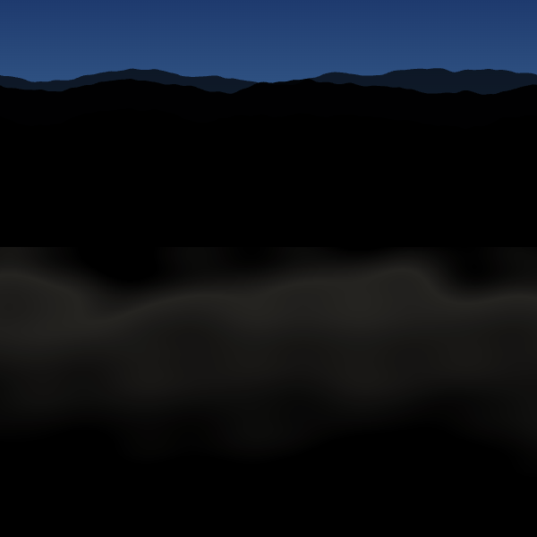](examples/haze/heat-haze.png) | `heat-haze` | Heat Haze | Shimmering heat distortion | heat, haze, shimmer, hot |

### Fence (4)

[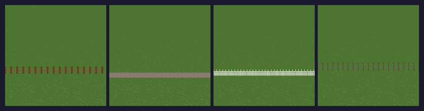](#fence-4)

| Preview | ID | Name | Description | Tags |
|---|---|---|---|---|
| [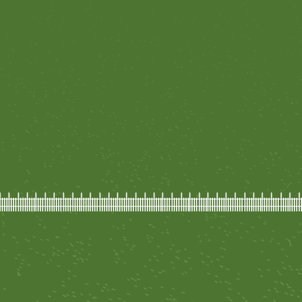](examples/fence/white-picket.png) | `white-picket` | White Picket | Classic white picket fence | white, picket, classic, garden |
| [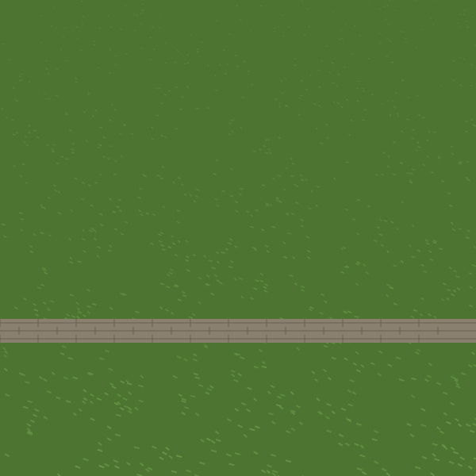](examples/fence/stone-wall.png) | `stone-wall` | Stone Wall | Low dry-stone wall | stone, wall, rustic, rural |
| [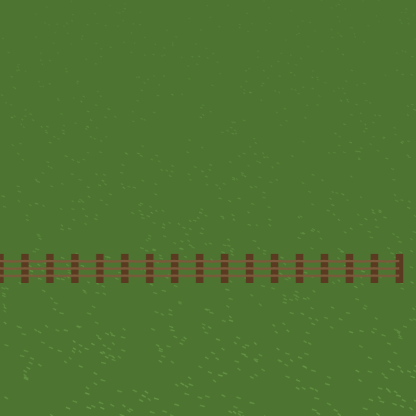](examples/fence/ranch-rail.png) | `ranch-rail` | Ranch Rail | Horizontal ranch rail fence | ranch, rail, wooden, pastoral |
| [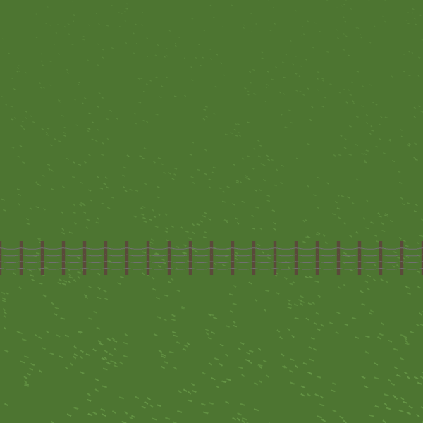](examples/fence/wire-fence.png) | `wire-fence` | Wire Fence | Simple wire fence with posts | wire, fence, simple, rural |

### Boat (4)

[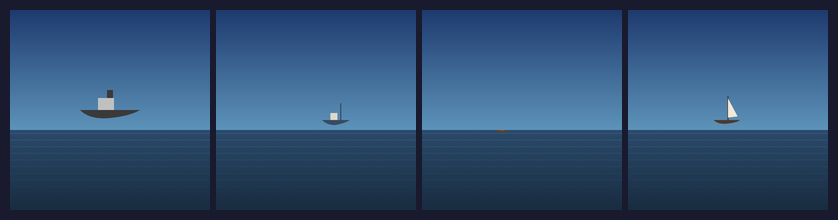](#boat-4)

| Preview | ID | Name | Description | Tags |
|---|---|---|---|---|
| [](examples/boat/sailboat.png) | `sailboat` | Sailboat | Single-mast sailboat | sailboat, sail, coastal, classic |
| [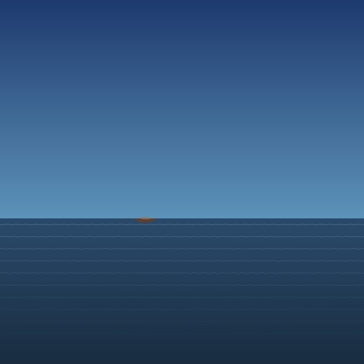](examples/boat/rowboat.png) | `rowboat` | Rowboat | Small rowboat | rowboat, small, lake, simple |
| [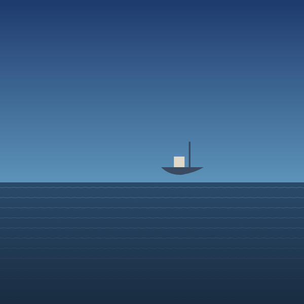](examples/boat/fishing-boat.png) | `fishing-boat` | Fishing Boat | Working fishing boat | fishing, boat, working, coastal |
| [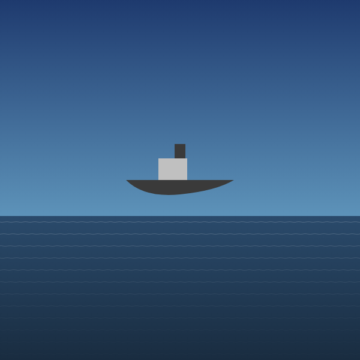](examples/boat/cargo-ship.png) | `cargo-ship` | Cargo Ship | Large cargo vessel silhouette | cargo, ship, large, industrial |

### Erosion (4)

[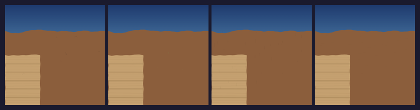](#erosion-4)

| Preview | ID | Name | Description | Tags |
|---|---|---|---|---|
| [](examples/erosion/rain-streaks.png) | `rain-streaks` | Rain Streaks | Vertical rain erosion streaks | rain, streaks, vertical, wet |
| [](examples/erosion/wind-erosion.png) | `wind-erosion` | Wind Erosion | Horizontal wind erosion marks | wind, erosion, horizontal, dry |
| [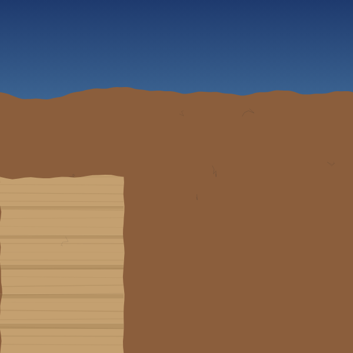](examples/erosion/frost-cracks.png) | `frost-cracks` | Frost Cracks | Frost-heave crack patterns | frost, cracks, cold, fractured |
| [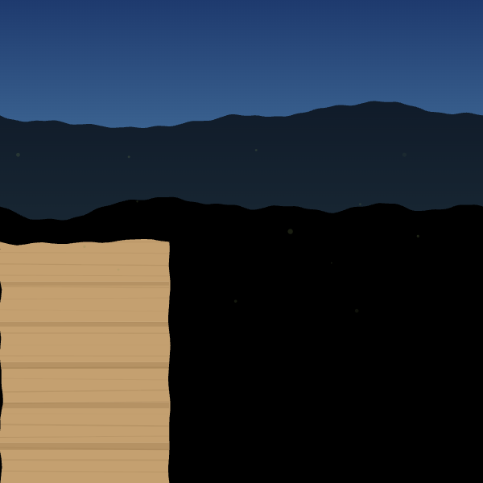](examples/erosion/lichen-growth.png) | `lichen-growth` | Lichen Growth | Patches of lichen on rock surfaces | lichen, growth, organic, old |

### Landscape Composites (6)

[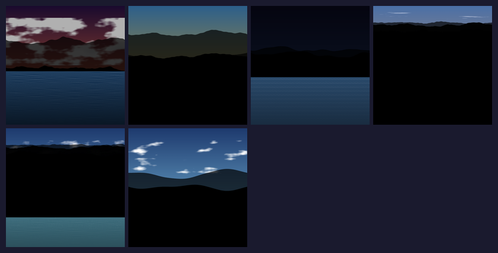](#landscape-composites-6)

Multi-layer scenes combining sky, terrain, clouds, and water:

| Preview | ID | Name | Layers |
|---|---|---|---|
| [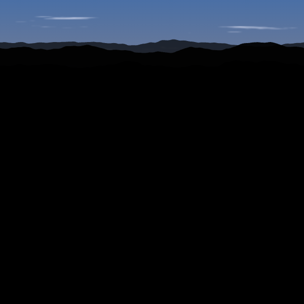](examples/landscape/mountain-dawn.png) | `mountain-dawn` | Mountain Dawn | dawn sky + alpine-range profile + wispy-high clouds |
| [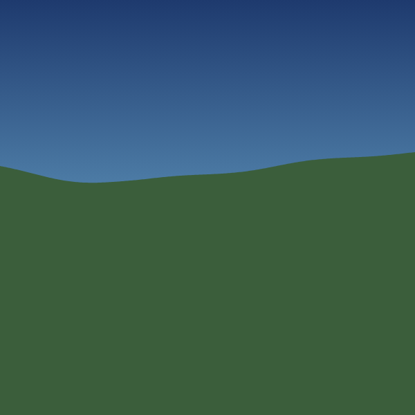](examples/landscape/rolling-pastoral.png) | `rolling-pastoral` | Rolling Pastoral | noon sky + rolling-hills profile + fair-weather clouds |
| [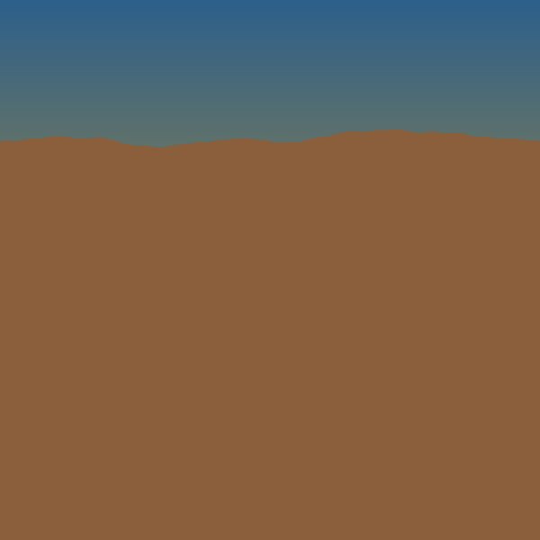](examples/landscape/desert-sunset.png) | `desert-sunset` | Desert Sunset | golden-hour sky + mesa-plateau + sand-dunes profiles |
| [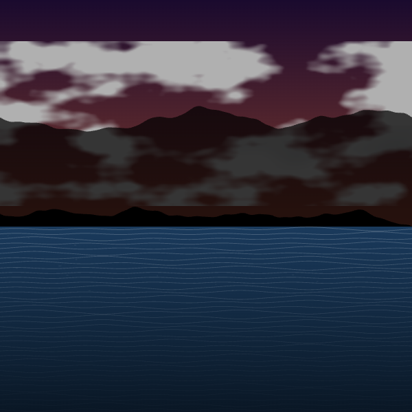](examples/landscape/coastal-storm.png) | `coastal-storm` | Coastal Storm | dusk sky + coastal-cliffs profile + storm clouds + choppy sea |
| [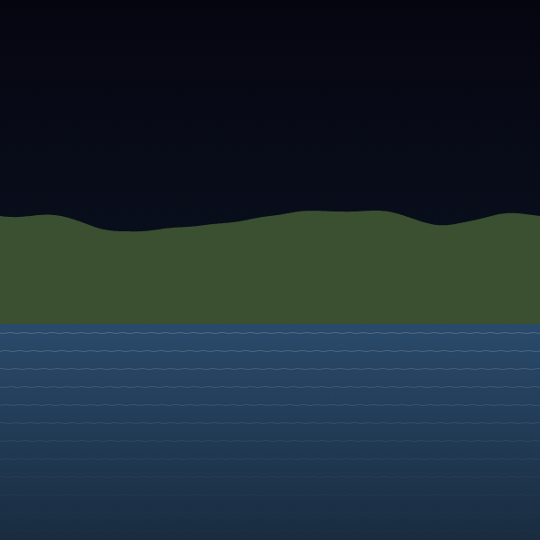](examples/landscape/lake-at-night.png) | `lake-at-night` | Lake at Night | night sky + foothills profile + still-lake water |
| [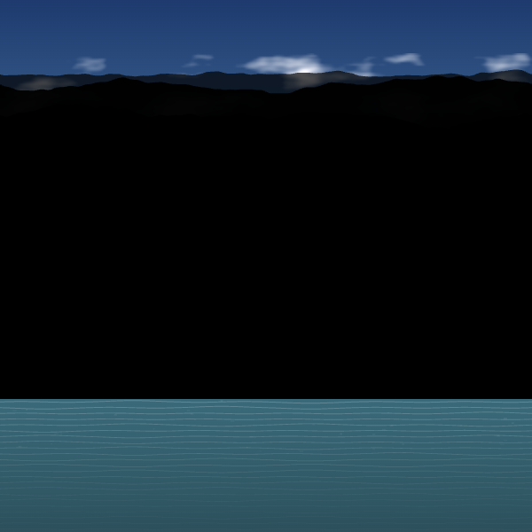](examples/landscape/mountain-stream-scene.png) | `mountain-stream-scene` | Mountain Stream | noon sky + alpine-range profile + scattered clouds + mountain-stream water |

### Scene Recipes (12)

[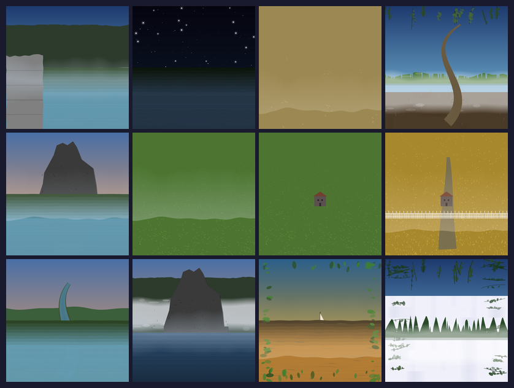](#scene-recipes-12)

Multi-layer scenes assembled by the scene recipe MCP tools:

| Preview | ID | Name | Layers |
|---|---|---|---|
| [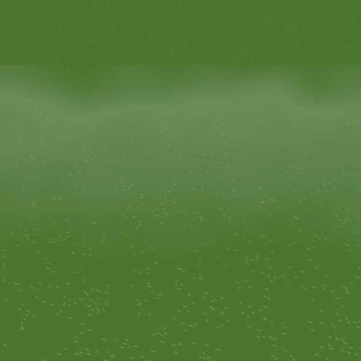](examples/scenes/mountain-valley.png) | `mountain-valley` | Mountain Valley | sky + alpine ridges + fog + treeline + field + haze |
| [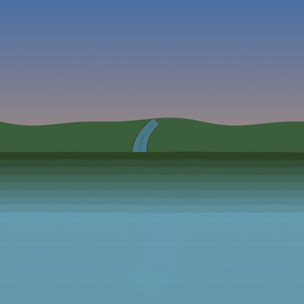](examples/scenes/river-scene.png) | `river-scene` | River Scene | sky + hills + river + shore + treeline + reflection |
| [](examples/scenes/coastal-moonlight.png) | `coastal-moonlight` | Coastal Moonlight | night sky + starfield + moon + water + shore + reflection |
| [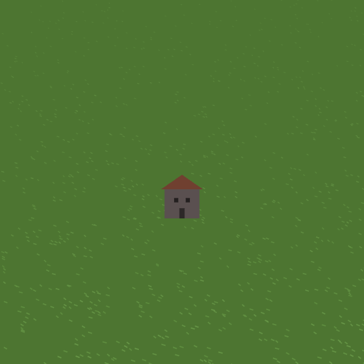](examples/scenes/park-riverside.png) | `park-riverside` | Park Riverside | sky + terrain + river + path + treeline + field + building |
| [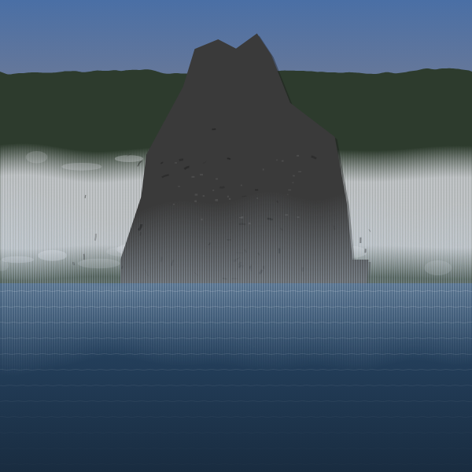](examples/scenes/shan-shui.png) | `shan-shui` | Shan Shui | sky + peaks + fog + rock + water + haze |
| [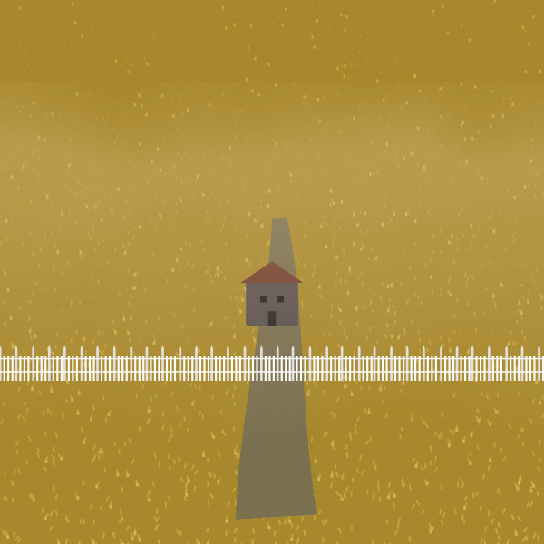](examples/scenes/pastoral.png) | `pastoral` | Pastoral | golden-hour sky + hills + wheat field + path + fence + building + haze |
| [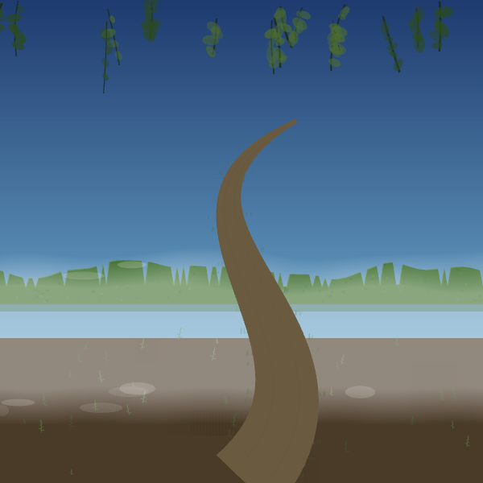](examples/scenes/forest-clearing.png) | `forest-clearing` | Forest Clearing | sky + treeline + vignette + forest floor + fog + path |
| [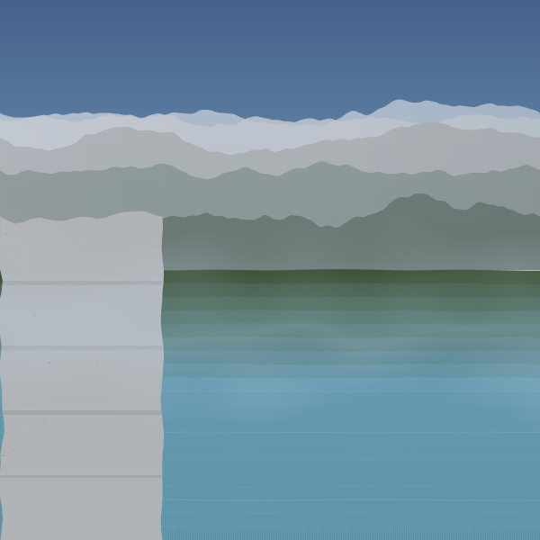](examples/scenes/alpine-lake.png) | `alpine-lake` | Alpine Lake | sky + alpine range + snowfield + water + reflection + cliff + haze |
| [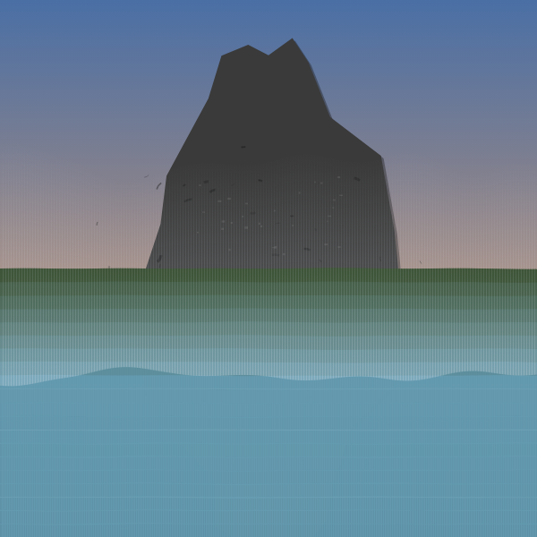](examples/scenes/japanese-garden.png) | `japanese-garden` | Japanese Garden | sky + water + bridge + rock + treeline + reflection + haze |
| [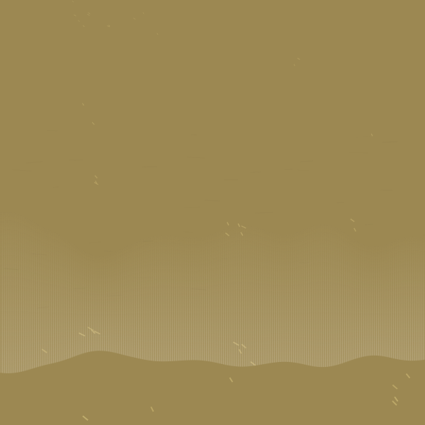](examples/scenes/desert-expanse.png) | `desert-expanse` | Desert Expanse | sky + mesa + cliff + field + haze + erosion |
| [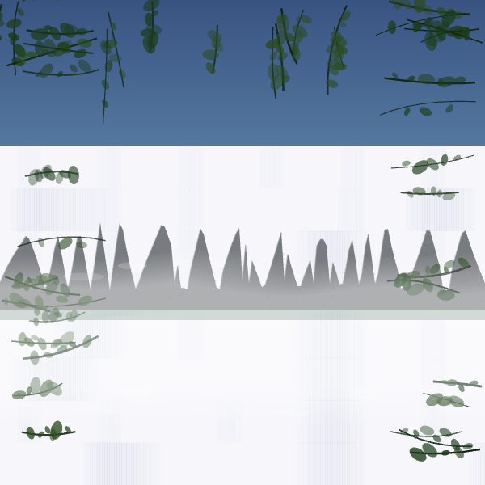](examples/scenes/winter-woodland.png) | `winter-woodland` | Winter Woodland | sky + terrain + snow + treeline + vignette + fog |
| [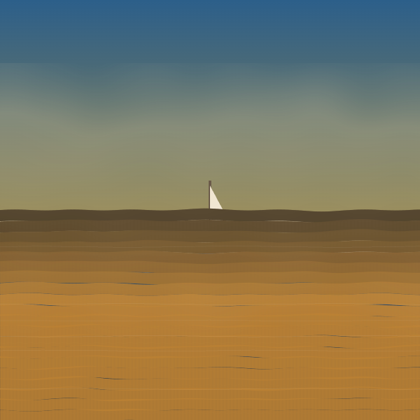](examples/scenes/tropical-coast.png) | `tropical-coast` | Tropical Coast | golden-hour sky + water + shore + boat + reflection + vignette + haze |

## Examples

The `examples/` directory contains 146 `.genart` sketch files organized by category, with `.png` thumbnails and `.genart-workspace` files:

```
examples/
├── sky/               5 sky gradient presets
├── profile/           6 terrain ridgeline presets
├── clouds/            5 cloud formation presets
├── water/             5 water surface presets
├── river/             8 perspective river presets
├── path/              8 trail and road presets
├── shore/             6 shoreline transition presets
├── field/             8 vegetation field presets
├── rock/              6 natural rock form presets
├── treeline/          6 canopy silhouette presets
├── celestial/         6 sun/moon/star presets
├── fog/               5 fog and mist presets
├── starfield/         5 star field presets
├── cliff-face/        5 cliff wall presets
├── snowfield/         4 snow ground presets
├── building/          6 architectural silhouette presets
├── bridge/            4 bridge structure presets
├── reflection/        4 water reflection presets
├── vignette-foliage/  5 framing foliage presets
├── forest-floor/      5 ground cover presets
├── haze/              4 atmospheric haze presets
├── fence/             4 fence/wall presets
├── boat/              4 boat silhouette presets
├── erosion/           4 weathering texture presets
├── landscape/         6 v1 composite scenes
├── scenes/           12 v2 scene recipe compositions
└── terrain-gallery.genart-workspace  (all sketches)
```

**Regenerating examples:**

```bash
node generate-genart-files.cjs        # Create .genart files from presets
node generate-workspace-files.cjs     # Create .genart-workspace files
node render-examples.cjs              # Render .png thumbnails (requires local CLI)
node generate-galleries.cjs           # Create category gallery montages
```

## MCP Tools (41)

Exposed to AI agents through the MCP server when this plugin is registered.

### Add Layer Tools (24)

| Tool | Description |
|---|---|
| `add_sky` | Add a sky gradient layer with time-of-day preset or custom colors |
| `add_terrain_profile` | Add terrain ridgeline silhouettes from profile presets |
| `add_clouds` | Add noise-driven cloud formations (cumulus, stratus, cirrus) |
| `add_water_surface` | Add water surface with waves and shimmer highlights |
| `add_river` | Add a perspective river with flow path and banks |
| `add_path` | Add a trail or road with surface texture |
| `add_shore` | Add a shoreline transition layer |
| `add_field` | Add a vegetation field with depth-aware marks |
| `add_rock` | Add natural rock forms |
| `add_treeline` | Add a tree canopy silhouette band |
| `add_celestial` | Add celestial bodies (sun, moon, stars) with glow |
| `add_fog_layer` | Add an occluding fog band |
| `add_starfield` | Add a star field with optional Milky Way |
| `add_cliff_face` | Add a vertical cliff or rock wall silhouette |
| `add_snowfield` | Add snow-covered ground with drifts |
| `add_building` | Add an architectural silhouette |
| `add_bridge` | Add a bridge structure |
| `add_reflection` | Add water surface reflections |
| `add_vignette_foliage` | Add framing foliage along canvas edges |
| `add_forest_floor` | Add ground cover undergrowth |
| `add_haze` | Add subtle atmospheric haze |
| `add_fence` | Add a fence or wall silhouette |
| `add_boat` | Add a boat silhouette on water |
| `add_erosion` | Add weathering/erosion texture |

### Scene Recipe Tools (13)

Complete landscape compositions assembled from multiple layers:

| Tool | Description |
|---|---|
| `create_landscape` | Sky + terrain profile + optional clouds + water |
| `create_mountain_valley` | Sky + alpine ridges + fog + treeline + field + haze |
| `create_river_scene` | Sky + hills + river + shore + treeline + reflection |
| `create_coastal_moonlight` | Night sky + starfield + moon + water + shore + reflection |
| `create_park_riverside` | Sky + terrain + river + path + treeline + field + building |
| `create_shan_shui` | Chinese landscape: sky + peaks + fog + rock + water + haze |
| `create_pastoral` | Golden-hour countryside: sky + hills + wheat field + path + fence + building + haze |
| `create_forest_clearing` | Sky + treeline + vignette + forest floor + fog + path |
| `create_alpine_lake` | Sky + alpine range + snowfield + water + reflection + cliff + haze |
| `create_japanese_garden` | Sky + water + bridge + rock + treeline + reflection + haze |
| `create_desert_expanse` | Sky + mesa + cliff + field + haze + erosion |
| `create_winter_woodland` | Sky + terrain + snow + treeline + vignette + fog |
| `create_tropical_coast` | Golden-hour coast: sky + water + shore + boat + reflection + vignette + haze |

### Utility Tools (4)

| Tool | Description |
|---|---|
| `set_time_of_day` | Update a sky layer to a different time-of-day preset |
| `list_terrain_presets` | List all 128 presets, optionally filtered by category |
| `set_terrain_depth` | Adjust depth properties on a terrain profile layer |
| `set_depth_lane` | Update depth lane assignment on any layer |

## Rendering

Each layer type renders via canvas2d:

- **Sky** — Three-stop vertical gradient (zenith → haze → horizon) with configurable haze band
- **Profile** — Back-to-front ridgeline silhouettes with fractal noise elevation and depth-aware color interpolation
- **Clouds** — Fractal noise sampled per-pixel into an ImageData buffer with cloud/shadow color blending
- **Water** — Vertical gradient fill with sine or noise-driven wave lines and shimmer highlight streaks
- **River/Path/Shore** — Perspective bezier curves with depth-aware width scaling and surface textures
- **Field** — Depth-aware mark generation (grass blades, wheat stalks, flowers) with perspective scaling
- **Rock** — Procedural rock silhouettes with fractal detail and depth-placed shading
- **Treeline** — Canopy silhouette generation with per-tree variation and atmospheric coloring
- **Celestial** — Radial gradient glow with optional lens flare and corona effects
- **Fog** — Horizontal noise-driven opacity band with soft edges
- **Starfield** — Pseudo-random star placement with brightness variation and optional galaxy band
- **Building/Bridge/Fence/Boat** — Silhouette rendering with depth-aware scaling and atmospheric tinting
- **Reflection** — Mirrored color sampling from sky/terrain tones with ripple distortion
- **Erosion** — Directional mark overlays (rain streaks, wind scour, frost cracks, lichen patches)
- **Haze/Vignette/Snowfield/Forest Floor/Cliff Face** — Full-canvas or region-based procedural textures

## Utilities

Shared utilities exported for advanced use:

```typescript
import {
  mulberry32,                          // Deterministic PRNG
  createValueNoise, createFractalNoise, // Procedural noise generators
  parseHex, toHex, lerpColor,          // Color interpolation
  darken, lighten,                     // Color adjustment
  applyDepthEasing,                    // Depth curve functions
  resolveDepthLane,                    // Depth lane resolution
  depthForLane,                        // Lane → depth value
  DEPTH_LANE_ORDER,                    // Lane names in order
  DEPTH_LANE_OPTIONS,                  // UI-ready enum options
} from "@genart-dev/plugin-terrain";
```

## Preset Discovery

```typescript
import { ALL_PRESETS, filterPresets, searchPresets, getPreset } from "@genart-dev/plugin-terrain";

// All 128 presets
console.log(ALL_PRESETS.length); // 128

// Filter by category
const skyPresets = filterPresets({ category: "sky" });     // 5 presets
const profiles = filterPresets({ category: "profile" });   // 6 presets
const rivers = filterPresets({ category: "river" });       // 8 presets

// Filter by tags
const dramatic = filterPresets({ tags: ["dramatic"] });

// Full-text search
const results = searchPresets("mountain");

// Look up by ID
const preset = getPreset("alpine-range");
```

## Related Packages

| Package | Purpose |
|---|---|
| [`@genart-dev/core`](https://github.com/genart-dev/core) | Plugin host, layer system (dependency) |
| [`@genart-dev/mcp-server`](https://github.com/genart-dev/mcp-server) | MCP server that surfaces plugin tools to AI agents |
| [`@genart-dev/plugin-plants`](https://github.com/genart-dev/plugin-plants) | Algorithmic plant generation (110 presets) |
| [`@genart-dev/plugin-patterns`](https://github.com/genart-dev/plugin-patterns) | Geometric and organic pattern fills (153 presets) |
| [`@genart-dev/plugin-particles`](https://github.com/genart-dev/plugin-particles) | Particle systems (15 presets) |

## Support

Questions, bugs, or feedback — [support@genart.dev](mailto:support@genart.dev) or [open an issue](https://github.com/genart-dev/plugin-terrain/issues).

## License

MIT
